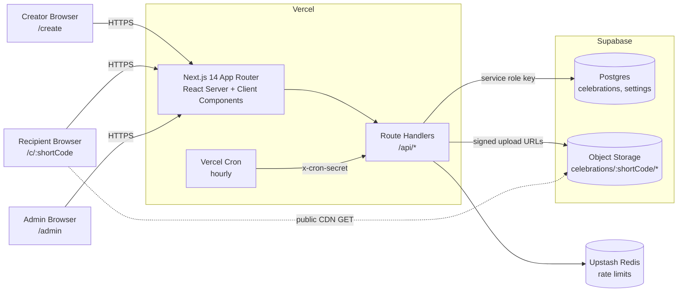
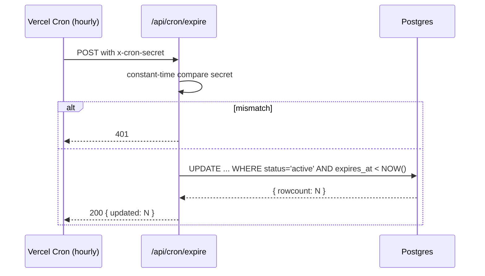
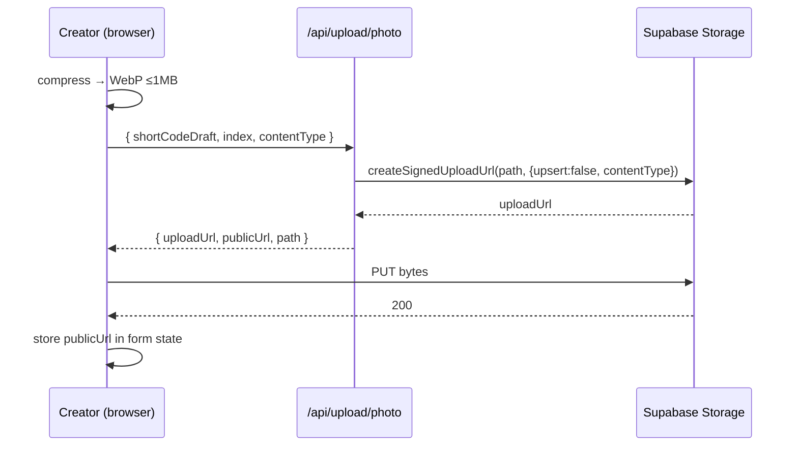
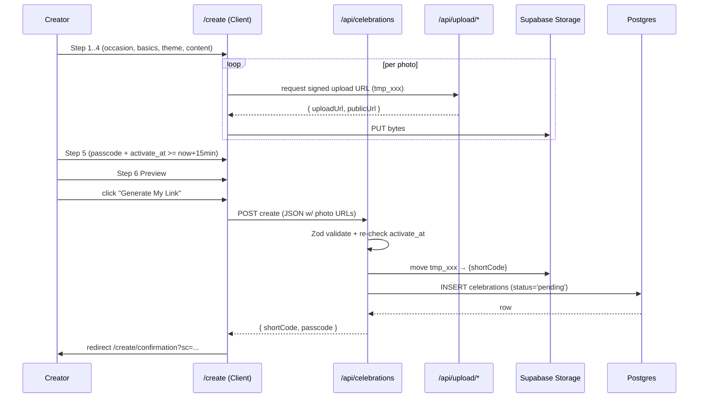
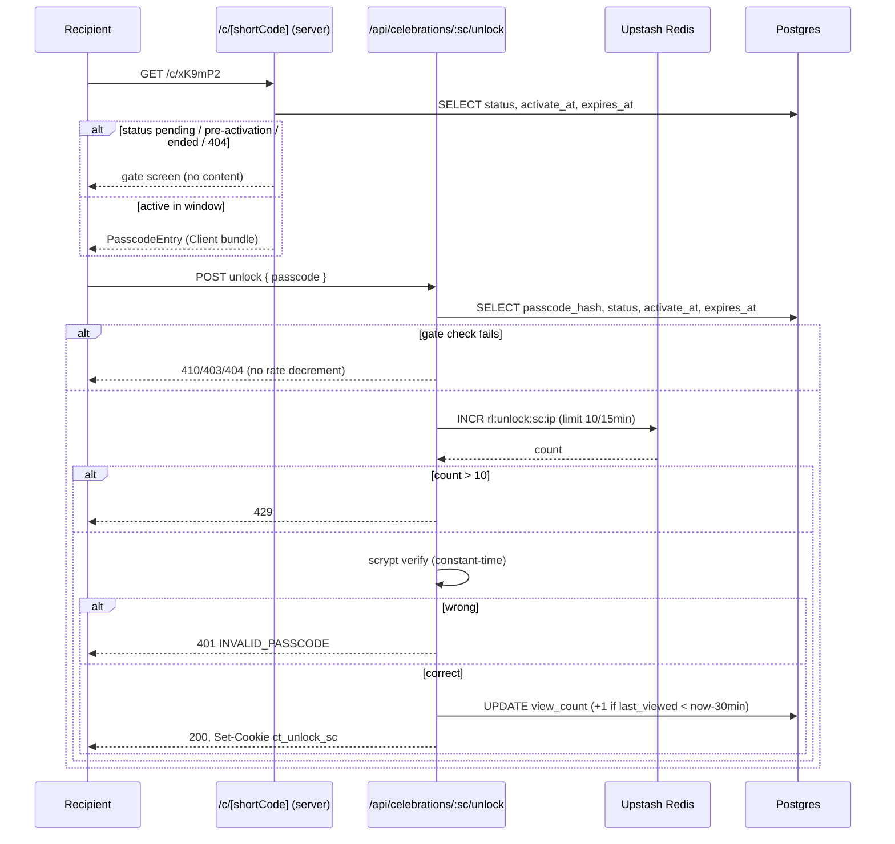
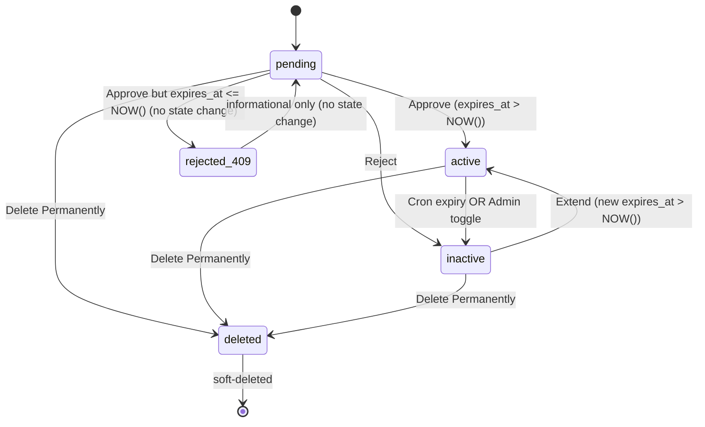

# CelebrateThem — Design Document

## Overview

CelebrateThem is a production-grade Next.js 14+ platform for creating passcode-protected, cinematic surprise experiences (Birthday Celebrations and Soft Expressions). This document specifies the end-to-end design that implements all 31 requirements in `requirements.md`, including the admin approval pipeline introduced in Requirements 28–30 and the Admin Passcode Reset flow introduced in Requirement 31.

The system is built around three user surfaces:

1. **Creator surface** (`/create`) — A multi-step guided wizard that collects content, uploads media, sets a 4-digit passcode, picks an activation time at least 15 minutes in the future, and persists a new row with `status = 'pending'`. The creator is then routed to a post-submission confirmation screen that explains the approval gate and provides an Instagram contact path driven entirely by environment variables.
2. **Recipient surface** (`/c/[shortCode]`) — A passcode-gated, scroll-driven, chapter-based experience with two variants (birthday, expression). Every recipient request is evaluated against a status × time gating matrix so pending, pre-activation, ended, and deleted states are never confused.
3. **Admin surface** (`/admin`) — A password-protected operator panel that handles the pending → active (Approve) or pending → inactive (Reject) transitions, the full lifecycle (toggle active/inactive, extend, edit, per-photo delete, permanent delete), reply management, settings, and visibility into storage usage.

The backend is Supabase (Postgres + Storage) accessed through Next.js App Router route handlers. The service role key is used only server-side; the anon key is used only for safe read scenarios (and we choose to not expose the recipient data path through the anon key — see Security). Vercel Cron invokes `/api/cron/expire` to transition `active → inactive` when the 21-hour window elapses. Rate limiting is implemented against Upstash Redis (recommended for Vercel serverless) with a scoped in-memory fallback for local development only.

Correctness is treated as a first-class deliverable: Requirement 27 defines 18 invariants, and this design maps each one to either a property-based test (via `fast-check`) or a schema/DB-level invariant.

### Design principles

- Server-authoritative state. Time math, status transitions, expiry, view count, rate limits, and approval happen on the server; the client never decides.
- Fail closed on the recipient path. Any ambiguity about status, window, or unlock resolves to the gating message, never to content leakage.
- Creator content is untrusted input. All text is validated server-side with Zod schemas that mirror the client schemas, and rendered through React's JSX escaping only — no `dangerouslySetInnerHTML`.
- Pure rendering for the Reply_Image. The Canvas render is deterministic given the same inputs so Requirement 27.10 (byte-identical PNG) holds.
- Small initial bundles. Chapter code-splits by type so a birthday recipient never downloads expression logic (and vice versa).

---

## Architecture

### System architecture diagram



### Tech stack and runtime choices

| Layer | Choice | Notes |
|------|--------|------|
| Framework | Next.js 14+ (App Router) | React Server Components by default; Client Components at interaction boundaries |
| Runtime | Node.js runtime for all `/api/*` route handlers | Service role key, bcrypt, and signed-cookie crypto require Node. Edge runtime is used only for static pages and any handler that does not touch Supabase server keys (currently none) |
| Database | Supabase Postgres | One table (`celebrations`), optional `settings`, optional `rate_limits` |
| Object storage | Supabase Storage | Bucket `celebrations`, path prefix `celebrations/{shortCode}/` |
| Rate limiting | Upstash Redis (REST) | Fallback: in-memory Map for local dev only; documented caveats below |
| Hosting | Vercel | Vercel Cron triggers `/api/cron/expire` at least hourly |
| Styling | Tailwind CSS + CSS variables per theme | Theme tokens set on `:root` scoped to a theme class |
| Scroll animations | GSAP + ScrollTrigger | Lazy-imported inside birthday/expression chapters |
| Mount transitions | Framer Motion | Used across shared UI |
| Particles | `canvas-confetti` + `tsparticles` | Lazy-imported; suppressed under `prefers-reduced-motion` |
| Audio | HTML5 Audio | Single persistent player component |
| Canvas | HTML Canvas | Reply image + Admin reply image generator share one pure render function |
| State (form) | Zustand with `persist` middleware (sessionStorage) | Chosen over React Context + reducer because slices across steps are independent and `persist` gives us step-level resumption with no boilerplate |

Reasoning for Zustand: the creator form has ~6 steps touching unrelated slices (occasion, basics, theme, content, timing, preview). Context + reducer would require a single monolithic action union and eager re-renders across consumers; Zustand selectors let each step subscribe only to the slice it touches, and `persist` with `sessionStorage` gives us the "state preserved on Back" behavior Requirement 6.1 mandates with one line of configuration.

### Server vs client component boundaries

| Route | Default rendering | Client components |
|------|-------------------|-------------------|
| `/` (landing) | Server | CTA buttons (tiny) |
| `/create` | Server shell | Entire wizard is a single Client component tree (form state, file inputs, validation UI) |
| `/c/[shortCode]` | Server shell reads lifecycle gate (status + time) via `/api/celebrations/{shortCode}/status` on the server, returns either a gate screen (server) or a Client bundle for the experience | Passcode entry, all chapters, audio player, reply canvas, confetti — all Client |
| `/admin/*` | Server shell + middleware auth | List filters, detail edit forms, approve/reject actions, canvas reply preview |
| `/api/*` | N/A (route handlers) | |

### Component tree (high level)

```
App
├── app/layout.tsx                          (global providers: theme, toast, request-id)
├── app/page.tsx                            (landing)
├── app/create/page.tsx
│   └── components/form/CreatorWizard       (Client)
│       ├── StepOccasion
│       ├── StepBasics
│       ├── StepTheme
│       ├── StepContent (branches on type)
│       │   ├── BirthdayContentFields
│       │   └── ExpressionContentFields
│       ├── StepSecurityAndTiming
│       └── StepPreview (renders RecipientExperiencePreview with in-memory data)
├── app/create/confirmation/page.tsx
│   └── components/form/ConfirmationScreen  (copy buttons, Instagram contact, template)
├── app/c/[shortCode]/page.tsx              (server gate → client experience)
│   ├── components/experience/shared/LifecycleGate
│   ├── components/experience/shared/PasscodeEntry
│   ├── components/experience/shared/AudioPlayer
│   ├── components/experience/shared/ProgressIndicator
│   ├── components/experience/birthday/BirthdayExperience
│   │   ├── ChapterUnwrapping
│   │   ├── ChapterCinematicReveal
│   │   ├── ChapterStoryScroll
│   │   ├── ChapterReasonsConstellation
│   │   ├── ChapterQuiz
│   │   ├── ChapterUnwrapWishes
│   │   ├── ChapterCelebrationWheel
│   │   ├── ChapterFinalLetter
│   │   └── ChapterGrandFinale
│   └── components/experience/expression/ExpressionExperience
│       ├── ChapterEnvelope
│       ├── ChapterSlowBuild
│       ├── ChapterNoticing
│       ├── ChapterMoments
│       ├── ChapterConfession
│       ├── ChapterReply (hosts ReplyCanvas)
│       └── ChapterSoftEnding
├── app/admin/login/page.tsx
├── app/admin/page.tsx                      (dashboard)
├── app/admin/pending/page.tsx              (Pending approvals view)
├── app/admin/celebrations/page.tsx         (list)
├── app/admin/celebrations/[id]/page.tsx    (detail)
├── app/admin/settings/page.tsx
└── app/api/**                              (all server endpoints — see API surface)
```

---

## Components and Interfaces

### Shared primitives

- `lib/supabase/server.ts` — server client using service role key (never imported from Client Components).
- `lib/supabase/browser.ts` — anon client; used only for direct Storage reads where we decide the bucket/path is already public. Creator uploads do not use this; they go through the server-signed-upload flow (see below).
- `lib/cookies.ts` — signed cookie helpers: `signCookie(name, value)`, `verifyCookie(name, raw)`; HMAC-SHA256 with `COOKIE_SIGNING_SECRET`.
- `lib/passcode.ts` — `hashPasscode(plain, salt)` (scrypt, see Security), `verifyPasscode(plain, stored)` (constant-time).
- `lib/shortcode.ts` — `generateShortCode()` with `crypto.randomBytes` over the A–Z a–z 0–9 alphabet, length picked uniformly in `[6,8]`, collision retry up to 5 (Requirement 1.3).
- `lib/rate-limit.ts` — abstraction with `UpstashLimiter` and `InMemoryLimiter` implementations; chosen via env.
- `lib/validation/*.ts` — Zod schemas (detailed in Security).
- `lib/time.ts` — all time math in UTC; `nowUtc()`, `plusHours(ts, h)`, `isBefore(a, b)`; tests control the clock through dependency injection.
- `lib/logger.ts` — structured logger; redacts passcode, reply text, service role key, cookie secret; tags every log line with `request_id`.
- `lib/canvas/replyImage.ts` — pure render function that, given `{ replyText, recipientFirstName, dateIso, theme }`, returns a `Uint8Array` PNG. Used identically by recipient and admin.

### Recipient experience interfaces

- `CelebrationPublicPayload` — what the recipient client sees after unlock. Only Safe fields: `type`, `theme`, `recipient_name`, `creator_name`, `relationship`, `song_url`, `photos`, and the type-specific fields. Never includes `passcode`, hashes, `admin_notes`, `approved_by`.
- `LifecycleStatus` — enum returned by the status endpoint: `pending | pre_activation | active | ended | not_found`. The recipient never sees `inactive` vs `ended` distinction; both map to `ended`.

### Admin interfaces

- `CelebrationAdminRow` — all columns plus computed `storage_bytes` (only on detail).
- `CelebrationListQuery` — filters, search, sort, pagination (see API).

---

## Data Models

### `celebrations` table

```sql
CREATE TABLE celebrations (
  id UUID PRIMARY KEY DEFAULT gen_random_uuid(),

  -- Identity
  short_code VARCHAR(8) UNIQUE NOT NULL,
  passcode   VARCHAR(255) NOT NULL,  -- stored as scrypt hash with embedded salt+params
  passcode_version INTEGER NOT NULL DEFAULT 1,  -- incremented on admin passcode reset; embedded in unlock cookies

  -- Classification
  type    VARCHAR(20) NOT NULL
          CHECK (type IN ('birthday', 'expression')),
  status  VARCHAR(20) NOT NULL DEFAULT 'pending'
          CHECK (status IN ('pending', 'active', 'inactive', 'deleted')),
  theme   VARCHAR(50) NOT NULL,

  -- Common content
  recipient_name VARCHAR(100) NOT NULL,
  creator_name   VARCHAR(100) NOT NULL,
  relationship   VARCHAR(50)  NOT NULL,
  song_url       TEXT,
  photos         JSONB NOT NULL DEFAULT '[]'::jsonb,

  -- Birthday-only
  hero_text       TEXT,
  reasons         JSONB DEFAULT '[]'::jsonb,
  quiz_questions  JSONB DEFAULT '[]'::jsonb,
  final_message   TEXT,

  -- Expression-only
  confession_message TEXT,
  things_i_notice    JSONB DEFAULT '[]'::jsonb,
  closing_line       TEXT,

  -- Expression reply
  expression_reply             TEXT,
  expression_reply_downloaded  BOOLEAN NOT NULL DEFAULT FALSE,

  -- Timing (always UTC)
  activate_at  TIMESTAMPTZ NOT NULL,
  expires_at   TIMESTAMPTZ NOT NULL,
  created_at   TIMESTAMPTZ NOT NULL DEFAULT NOW(),

  -- Admin tracking
  approved_at        TIMESTAMPTZ NULL,
  approved_by        VARCHAR(100) NULL,
  admin_notes        TEXT NULL,
  times_reactivated  INTEGER NOT NULL DEFAULT 0,
  last_viewed_at     TIMESTAMPTZ NULL,
  view_count         INTEGER NOT NULL DEFAULT 0,

  -- Invariants from Requirement 27
  CONSTRAINT short_code_format CHECK (short_code ~ '^[A-Za-z0-9]{6,8}$'),
  CONSTRAINT temporal_order    CHECK (expires_at > activate_at),
  CONSTRAINT fixed_window_21h  CHECK (expires_at = activate_at + INTERVAL '21 hours'),
  CONSTRAINT approval_before_active CHECK (
    status <> 'active' OR approved_at IS NOT NULL
  ),
  CONSTRAINT birthday_shape CHECK (
    type <> 'birthday' OR (
      jsonb_array_length(reasons)        BETWEEN 5 AND 10
      AND jsonb_array_length(photos)     BETWEEN 3 AND 7
      AND jsonb_array_length(quiz_questions) = 5
      AND hero_text     IS NOT NULL
      AND final_message IS NOT NULL
    )
  ),
  CONSTRAINT expression_shape CHECK (
    type <> 'expression' OR (
      jsonb_array_length(things_i_notice) BETWEEN 3 AND 5
      AND jsonb_array_length(photos)      BETWEEN 2 AND 4
      AND confession_message IS NOT NULL
      AND char_length(confession_message) BETWEEN 1 AND 1500
      AND closing_line IS NOT NULL
    )
  )
);

CREATE INDEX idx_celeb_short_code  ON celebrations (short_code);
CREATE INDEX idx_celeb_status      ON celebrations (status);
CREATE INDEX idx_celeb_expires_at  ON celebrations (expires_at);
CREATE INDEX idx_celeb_activate_at ON celebrations (activate_at);
-- Supports admin search (case-insensitive substring on recipient/creator name)
CREATE INDEX idx_celeb_recipient_trgm ON celebrations USING gin (lower(recipient_name) gin_trgm_ops);
CREATE INDEX idx_celeb_creator_trgm   ON celebrations USING gin (lower(creator_name)   gin_trgm_ops);
-- Composite to serve list filters quickly at 10k rows
CREATE INDEX idx_celeb_status_type_activate_at ON celebrations (status, type, activate_at DESC);
```

Notes:

- The temporal constraint `expires_at > activate_at` (Req 27.1) and `expires_at = activate_at + INTERVAL '21 hours'` (Req 27.14) together guarantee both the directionality and the fixed window at the DB layer. Extending the window (Requirement 17.3) requires a controlled path: the extend action sets `expires_at = expires_at + INTERVAL 'h hours'` via a migration-aware stored expression, and the `fixed_window_21h` CHECK is deferred or dropped in favor of an immutable persisted column pair plus an application-level invariant. Because Req 27.14 only constrains *the instant of persistence*, we implement `fixed_window_21h` as a trigger rather than a CHECK: on INSERT it requires `expires_at = activate_at + INTERVAL '21 hours'`, on UPDATE it allows `expires_at` changes only when `activate_at` is unchanged and the change is a positive delta. See the trigger below.
- The birthday/expression shape checks encode Req 3 and Req 4 at the DB level, doubling up with server-side validation.

```sql
CREATE OR REPLACE FUNCTION trg_celebrations_window()
RETURNS TRIGGER AS $$
BEGIN
  IF TG_OP = 'INSERT' THEN
    IF NEW.expires_at <> NEW.activate_at + INTERVAL '21 hours' THEN
      RAISE EXCEPTION 'fixed_window_21h_violation' USING ERRCODE = '23514';
    END IF;
    RETURN NEW;
  END IF;

  IF TG_OP = 'UPDATE' THEN
    IF NEW.activate_at <> OLD.activate_at THEN
      RAISE EXCEPTION 'activate_at_is_immutable' USING ERRCODE = '23514';
    END IF;
    IF NEW.expires_at < OLD.expires_at THEN
      RAISE EXCEPTION 'expires_at_may_only_move_forward' USING ERRCODE = '23514';
    END IF;
    RETURN NEW;
  END IF;

  RETURN NEW;
END;
$$ LANGUAGE plpgsql;

CREATE TRIGGER celebrations_window
BEFORE INSERT OR UPDATE ON celebrations
FOR EACH ROW EXECUTE FUNCTION trg_celebrations_window();
```

The DB CHECK `fixed_window_21h` is replaced by this trigger; we leave the other CHECKs in place.

### `settings` table (optional but recommended)

```sql
CREATE TABLE settings (
  key   VARCHAR(64) PRIMARY KEY,
  value JSONB NOT NULL,
  updated_at TIMESTAMPTZ NOT NULL DEFAULT NOW()
);

-- Seeded rows:
-- ('default_activation_window_hours', '21')        Req 19.1 (future-facing only)
-- ('maintenance_mode', 'false')                    Req 19.2
-- ('admin_password_hash', '"<scrypt-hash>"')       Req 19.5 (when configured)
```

Maintenance mode and default window hours live here so the admin can toggle without a redeploy. The runtime still treats every persisted celebration's window as exactly 21 hours (Req 19.1 explicitly says the setting is future-facing and must not retroactively change `expires_at`).

### `rate_limits` — storage strategy

We do **not** use a `rate_limits` table. Rate limits are hot-path counters that should not touch Postgres:

- **Recommended:** Upstash Redis (REST API, edge-friendly, works from Vercel serverless). Three token-bucket / fixed-window counters:
  - `rl:unlock:{shortCode}:{ip}` — 10 attempts / 15 min (Req 9.5)
  - `rl:adminlogin:{ip}` — 5 attempts / 15 min (Req 15.5)
  - `rl:admin:reset-pc:{adminSessionId}` — 20 successful resets / 60 min (Req 31.6)
- **Fallback (local dev only):** an in-memory `Map<string, { count, resetAt }>` inside `lib/rate-limit.ts`. Caveats: does not work across serverless instances and loses state on cold start. This is acceptable only because dev typically runs a single Node process. Production is required to set `UPSTASH_REDIS_REST_URL` + `UPSTASH_REDIS_REST_TOKEN`; startup logs a warning and refuses to start if neither is set and `NODE_ENV === 'production'`.

### JSONB shapes

```ts
type Photo = { url: string; caption: string; order: number };
// photos: Photo[], ordered by `order`; server re-sorts on read.

type QuizQuestion = { prompt: string; options: [string, string, string, string]; correctIndex: 0|1|2|3 };
// quiz_questions: QuizQuestion[5] for birthday.

type Reason = string;           // reasons: string[5..10] for birthday
type NoticeLine = string;       // things_i_notice: string[3..5] for expression
```

All JSONB shapes are validated by Zod at write time and re-validated at read time (defensively) before being sent to the client.

### Constraints / invariants summary

| Invariant | Enforcement |
|----------|-------------|
| `expires_at > activate_at` | DB CHECK |
| `expires_at = activate_at + 21h` at INSERT | Trigger |
| `activate_at` immutable after INSERT | Trigger |
| `expires_at` monotonic (never moves backward) | Trigger |
| `short_code ~ '^[A-Za-z0-9]{6,8}$'` | DB CHECK |
| Birthday content shape | DB CHECK + Zod |
| Expression content shape | DB CHECK + Zod |
| `status = 'active'` implies `approved_at IS NOT NULL` | DB CHECK |
| Initial status `pending`, `approved_at` NULL, `approved_by` NULL | Default + Zod write path |
| `passcode_version >= 1` and incremented by exactly 1 on Admin reset | DB default + app-level (reset endpoint `UPDATE ... SET passcode_version = passcode_version + 1`) |

---

## API Surface

All handlers live under `app/api/**/route.ts` and run on the Node.js runtime. All responses are JSON with the error envelope `{ error: { code, message, details? } }` (Req 24.1). Every response echoes the `x-request-id` header (Req 24.4).

### Conventions

- **Content type**: `application/json` unless noted.
- **IDs**: `shortCode` for public paths, row `id` (UUID) for admin paths.
- **Authn**:
  - Public (creator/recipient) paths: none or the `ct_unlock_{shortCode}` cookie.
  - Admin paths: `ct_admin` cookie verified by middleware.
  - Cron path: `x-cron-secret` header equal to `CRON_SECRET`.
- **CSRF** for admin mutating routes: double-submit token — a non-HTTP-only `ct_csrf` cookie plus an `x-csrf-token` header that must match. The token is bound to the admin session.
- **Error codes** are documented in the Error catalog section.

### Public endpoints

#### POST `/api/celebrations`

Creates a new pending celebration.

```jsonc
// Request (multipart/form-data OR JSON + pre-signed uploads)
{
  "type": "birthday" | "expression",
  "theme": "confetti-burst" | ... ,
  "recipient_name": "...",
  "creator_name": "...",
  "relationship": "Partner" | ... ,
  "activate_at": "2025-11-20T22:00:00Z",   // ISO, UTC
  "passcode": "1234",                       // plaintext, only in this request

  // Birthday fields (conditional):
  "hero_text": "...", "reasons": ["..."], "quiz_questions": [...], "final_message": "...",

  // Expression fields (conditional):
  "confession_message": "...", "things_i_notice": ["..."], "closing_line": "...",

  // Media references returned by /api/upload/*:
  "photos": [{ "url": "https://.../photo_1.jpg", "caption": "...", "order": 1 }, ...],
  "song_url": "https://..."   // optional
}

// 201 Response
{
  "shortCode": "xK9mP2",
  "passcode": "1234",                  // returned exactly once (Req 1.1)
  "activate_at": "...", "expires_at": "..."
}
```

Server pipeline:

1. Validate with `CreateCelebrationSchema` (Zod) — returns `400 VALIDATION_FAILED` with `details.fields[]` on failure.
2. Enforce `activate_at >= now + 15 min` (Req 5.3); `400 ACTIVATE_AT_TOO_SOON` otherwise.
3. Enforce theme allowed for type (Req 2.4).
4. Hash passcode (scrypt, see Security).
5. Generate short code with retries (Req 1.3); `500 SHORT_CODE_GENERATION_FAILED`.
6. Insert row with `status='pending'`, `expires_at = activate_at + 21h`.
7. Return `{ shortCode, passcode, activate_at, expires_at }`. No row content is returned.

#### GET `/api/celebrations/{shortCode}/status`

Public lifecycle gate. Returns only the coarse status — never exposes content, theme, or `activate_at` (except in `pre_activation`, where the formatted time is explicitly required by Req 10.3).

```jsonc
// 200 Response
{
  "status": "pending" | "pre_activation" | "active" | "ended" | "not_found",
  "activate_at"?: "..."   // only when status = "pre_activation"
}
```

Server logic:

```
row = SELECT ... WHERE short_code = $1
if row is null or row.status = 'deleted' -> { status: 'not_found' }
if row.status = 'pending'                -> { status: 'pending' }
if row.status = 'inactive'               -> { status: 'ended' }
if row.status = 'active' and NOW() < activate_at -> { status: 'pre_activation', activate_at }
if row.status = 'active' and NOW() >= expires_at -> { status: 'ended' }
else                                     -> { status: 'active' }
```

#### POST `/api/celebrations/{shortCode}/unlock`

```jsonc
// Request
{ "passcode": "1234" }

// 200 Response — sets Set-Cookie: ct_unlock_{shortCode}=<signed>; HttpOnly; Secure; SameSite=Lax; Path=/; Max-Age=86400
{ "ok": true }

// 401
{ "error": { "code": "INVALID_PASSCODE", "message": "That's not quite right. Try again 💛" } }

// 429
{ "error": { "code": "RATE_LIMITED", "message": "Too many attempts. Please try again later." } }

// 410 (when active+expired or inactive)
{ "error": { "code": "CELEBRATION_ENDED", "message": "..." } }
```

Server logic:

1. Reject immediately if status != `active` or current time not in `[activate_at, expires_at)` (`410 CELEBRATION_ENDED` or `404 NOT_FOUND` or `403 NOT_YET_ACTIVE`).
2. Consume a token from `rl:unlock:{shortCode}:{ip}` (10 / 15min). If exceeded, `429`.
3. Verify passcode (`verifyPasscode`). If mismatch, return `401` (still consumed the token). Always complete in approx constant time.
4. On success: issue signed cookie, atomic view-count increment with 30-min dedupe:

```sql
-- atomic increment respecting 30-min dedupe (Req 20.2)
UPDATE celebrations
   SET view_count     = view_count + 1,
       last_viewed_at = NOW()
 WHERE id = $1
   AND (last_viewed_at IS NULL OR last_viewed_at < NOW() - INTERVAL '30 minutes');
```

Whether the UPDATE affected 0 or 1 row does not change the response; it only affects whether the metric bumped.

#### GET `/api/celebrations/{shortCode}/content`

Returns the full public payload. Requires a valid `ct_unlock_{shortCode}` cookie **and** status=active **and** within window. Never returns anything for `pending` or `deleted`.

```jsonc
{
  "type": "birthday",
  "theme": "confetti-burst",
  "recipient_name": "...",
  "creator_name": "...",
  "relationship": "...",
  "song_url": "..." | null,
  "photos": [{ "url": "...", "caption": "...", "order": 1 }, ...],
  "hero_text": "...", "reasons": [...], "quiz_questions": [...], "final_message": "...",
  // OR the expression fields
}
```

Never returns: `passcode`, `admin_notes`, `approved_by`, `approved_at`, `expression_reply`, `expression_reply_downloaded`, `view_count`, `last_viewed_at`.

#### POST `/api/celebrations/{shortCode}/reply`

```jsonc
// Request
{ "replyText": "..." }   // 1..200 chars, trimmed
```

- Requires unlock cookie.
- Requires `type='expression'` (`400 NOT_EXPRESSION`) and `status='active'` in window (`410 CELEBRATION_ENDED`), per Req 14.8.
- Writes `expression_reply = trimmed`, leaves `expression_reply_downloaded = FALSE`.
- The reply text is never logged (Req 24.3).

#### Media upload

We use **server-issued signed upload URLs directly to Supabase Storage** rather than proxying bytes through the server. Reasoning: keeps Vercel function time/payload small, avoids the 4.5MB Vercel body limit, and lets the client apply progress UI. The server still decides the destination path, enforces MIME via Supabase bucket policies, and retains authority over the file URL returned.

Tradeoffs considered:

- **Direct-to-Storage (chosen):** faster uploads, no server body cap, simpler serverless. Needs careful scoping of signed URLs (single-object, short TTL). Cannot enforce exact byte count server-side but Supabase accepts a `maxSize` option and we do client-side compression first.
- **Server-proxied:** simpler mental model, lets us hash/content-type-sniff server-side. Hits body limits and doubles the data path.

##### POST `/api/upload/photo`

```jsonc
// Request
{ "shortCodeDraft": "tmp_xyz", "index": 1, "contentType": "image/webp" }

// 200
{ "uploadUrl": "https://...", "publicUrl": "https://.../celebrations/tmp_xyz/photo_1.webp", "path": "celebrations/tmp_xyz/photo_1.webp" }
```

- `shortCodeDraft` is a random token scoped to the in-progress form (so multiple drafts don't clash); on successful create, we copy (or rename) files from `celebrations/tmp_xyz/*` to `celebrations/{shortCode}/*` in a server transaction before persisting (Req 7.3). A nightly cleanup task purges unclaimed `tmp_*` prefixes after 24h.
- MIME enforced to `image/jpeg | image/png | image/webp` (Req 7.5) — reject with `415 UNSUPPORTED_PHOTO_TYPE`.

##### POST `/api/upload/audio`

Same shape, MIME allowlist `audio/mpeg | audio/mp4`, max 5MB declared (Req 8.1).

### Admin endpoints

All admin endpoints require the `ct_admin` session cookie + CSRF token (for mutations). Middleware under `middleware.ts` handles this for `/admin/**` and `/api/admin/**`.

#### POST `/api/admin/login`

```jsonc
// Request
{ "password": "..." }

// 200 — sets ct_admin + ct_csrf cookies
{ "ok": true }

// 401 — after fixed 400ms delay (Req 15.3)
{ "error": { "code": "INVALID_CREDENTIALS", "message": "Invalid password" } }

// 429
{ "error": { "code": "RATE_LIMITED", "message": "Too many attempts" } }
```

Server logic: if `ADMIN_PASSWORD_HASH` is configured (settings row or env), verify with scrypt. Otherwise compare plaintext to `ADMIN_PASSWORD` env var in constant time. Always sleep `max(0, 400ms - elapsed)` on failure.

#### POST `/api/admin/logout`

Clears `ct_admin`.

#### GET `/api/admin/stats`

```jsonc
// 200
{
  "active":  123,
  "pending": 7,
  "inactive": 45,
  "totalEverCreated": 540,
  "expiringNext2h": 3
}
```

Implementation: a single query with `COUNT(*) FILTER (WHERE ...)` to avoid round-trips.

#### GET `/api/admin/celebrations`

Filters + search + sort + pagination (Req 16, Req 30.1/30.2).

```
?status=pending,active
&type=birthday
&q=partial-text
&activateFrom=2025-01-01T00:00:00Z
&activateTo=2025-12-31T23:59:59Z
&sort=created_at|activate_at|expires_at|approved_at|view_count
&order=asc|desc
&page=1&pageSize=50
```

Response:

```jsonc
{
  "rows": [ /* CelebrationAdminRow[] */ ],
  "page": 1,
  "pageSize": 50,
  "total": 8421
}
```

Performance budget (Req 16.4): 500ms @ 10k rows. The composite index `(status, type, activate_at DESC)` plus the trigram indexes on `lower(recipient_name)`/`lower(creator_name)` support the common query shapes. `COUNT(*)` over the filtered set is the most expensive piece; for `>10k` rows we may approximate via `pg_class.reltuples` with a fast-path, but the requirement caps at 10k, so an exact count is fine.

#### POST `/api/admin/celebrations/{id}/approve`

Single atomic SQL that encodes all branches of Req 28.2 / 28.3 / 28.4 / 28.7:

```sql
WITH cur AS (SELECT id, status, expires_at FROM celebrations WHERE id = $1 FOR UPDATE)
UPDATE celebrations c
   SET status      = 'active',
       approved_at = NOW(),
       approved_by = 'admin'
  FROM cur
 WHERE c.id = cur.id
   AND cur.status = 'pending'
   AND cur.expires_at > NOW()
RETURNING c.id, c.status, c.approved_at, c.approved_by;
```

Then in application code:

- No `cur` row → `404`.
- `cur.status = 'deleted'` → `404` (Req 28.7).
- `cur.status = 'active'` → `200` no-op (Req 28.4 idempotence).
- `cur.status = 'pending'` and `cur.expires_at <= NOW()` → `409 APPROVAL_WINDOW_ELAPSED` (Req 28.3).
- `cur.status = 'pending'` and UPDATE RETURNING returned a row → `200` with the new state.

#### POST `/api/admin/celebrations/{id}/reject`

```jsonc
// Request
{ "admin_notes": "..." }   // optional, 0..2000 chars
```

```sql
WITH cur AS (SELECT id, status FROM celebrations WHERE id = $1 FOR UPDATE)
UPDATE celebrations c
   SET status      = 'inactive',
       admin_notes = COALESCE($2, c.admin_notes)
  FROM cur
 WHERE c.id = cur.id
   AND cur.status IN ('pending', 'inactive')   -- idempotent
   AND cur.status <> 'deleted'
RETURNING c.id, c.status, c.admin_notes;
```

- `deleted` → `404`.
- already `inactive` → `200`, only updates `admin_notes` if provided (Req 28.6).
- `active` → `409 CANNOT_REJECT_ACTIVE` (not in the pending→inactive path).

#### PATCH `/api/admin/celebrations/{id}`

Edit + status toggle + extend. The body is partial and Zod-validated field by field against the same limits as creation. Accepted fields:

- Text fields: `recipient_name`, `creator_name`, `relationship`, `hero_text`, `final_message`, `closing_line`, `confession_message`, `admin_notes`.
- JSON fields: `reasons`, `quiz_questions`, `things_i_notice`, `photos` (caption/order edits only; add/delete handled by dedicated endpoints).
- `status`: `'active' | 'inactive'` only; `'pending'` and `'deleted'` rejected here (Req 17.2).
- `extend_hours`: positive integer; server performs `expires_at = expires_at + INTERVAL '{h} hours'`. If the row was `inactive` and the extension would put `expires_at > NOW()`, the extend action may also flip status to `active` (Req 17.3) and increment `times_reactivated`.

All updates go through a single transaction.

#### POST `/api/admin/celebrations/{id}/photos/{idx}/delete`

Removes the object from Storage and splices `photos[idx]` from the JSONB array, atomically (same request, same transaction semantics). If Storage deletion fails, return `502 STORAGE_DELETE_FAILED` and leave the JSONB untouched.

#### POST `/api/admin/celebrations/{id}/delete`

Permanent soft-delete with storage purge (Req 17.6):

1. `SELECT` photos + `song_url` for the row.
2. Delete every object under `celebrations/{shortCode}/` in Storage.
3. If any deletion fails → `502 STORAGE_DELETE_FAILED`, row unchanged.
4. Otherwise `UPDATE celebrations SET status = 'deleted' WHERE id = $1`.

#### POST `/api/admin/celebrations/{id}/reply/mark-downloaded`

Sets `expression_reply_downloaded = TRUE` when the admin downloads the generated reply image (Req 18.3).

#### POST `/api/admin/celebrations/{id}/reset-passcode`

Admin-only, CSRF-bound. Because the stored `passcode` is a one-way scrypt hash, the plaintext cannot be recovered; this endpoint generates a new random 4-digit Passcode, rehashes it, bumps `passcode_version`, and returns the plaintext once.

```jsonc
// Request body: {} (no parameters; CSRF and auth cookies provide identity)

// 200 Response
{ "passcode": "1234", "passcode_version": 2 }

// 404 — row is deleted or missing (Req 31.3)
{ "error": { "code": "NOT_FOUND", "message": "Celebration not found." } }

// 429 — admin reset rate limit exceeded (Req 31.6)
{ "error": { "code": "RATE_LIMITED", "message": "Too many reset attempts. Please wait." } }
```

Server pipeline:

1. Consume a token from `rl:admin:reset-pc:{adminSessionId}` — 20 successful resets per 60 minutes. On exhaustion: `429 RATE_LIMITED`, no DB write.
2. Generate plaintext: `String(crypto.randomInt(0, 10000)).padStart(4, '0')` — guarantees `^[0-9]{4}$` (validates Property 22 / Req 27.18).
3. Rehash with the same scrypt parameters used at creation (`N=16384, r=8, p=1`, fresh 16-byte salt).
4. Atomic update:

   ```sql
   UPDATE celebrations
      SET passcode         = $hash,
          passcode_version = passcode_version + 1
    WHERE id = $1
      AND status <> 'deleted'
    RETURNING id, passcode_version;
   ```

   If zero rows returned → `404 NOT_FOUND`.
5. Return `{ passcode: <plaintext>, passcode_version: <new> }`. The plaintext is never written to logs (redaction list, Req 24.3) and never persisted.

Side effects on recipient unlock cookies: no explicit deletion is needed. Because unlock cookies embed the row's `passcode_version` at issue time (see Security model), every cookie minted under the pre-reset version is rejected on the next request to that Short_Code, and the Recipient is sent back to the Passcode entry screen.

#### GET `/api/admin/settings` / PATCH `/api/admin/settings`

Reads/writes the `settings` table. Fields: `default_activation_window_hours` (1..168, future-facing only), `maintenance_mode` (bool), `admin_password_hash` (writable via a dedicated "change password" sub-action that requires the current password).

### Cron endpoint

#### POST `/api/cron/expire`

Headers: `x-cron-secret: <CRON_SECRET>`.

```sql
UPDATE celebrations
   SET status = 'inactive'
 WHERE status = 'active'
   AND expires_at < NOW();
```

Response: `{ updated: <n> }`. Idempotent by construction (Req 27.7): a second invocation affects zero rows because every candidate row already has `status='inactive'`. Never touches `pending`, `inactive`, or `deleted` rows (Req 11.2, 28.9).

### Error envelope and request-id

Every response:

```
x-request-id: <uuid>
Content-Type: application/json

{ "error": { "code": "VALIDATION_FAILED", "message": "...", "details": { "fields": ["reasons[3]"] } } }
```

If the incoming request supplies `x-request-id`, we echo it; otherwise generate a v4 UUID.

### Error codes catalog

| HTTP | `code` | Where |
|-----:|--------|-------|
| 400  | `VALIDATION_FAILED` | Any input schema failure |
| 400  | `ACTIVATE_AT_TOO_SOON` | Creator POST |
| 400  | `THEME_NOT_ALLOWED_FOR_TYPE` | Creator POST |
| 400  | `NOT_EXPRESSION` | Reply POST on non-expression |
| 401  | `INVALID_PASSCODE` | Unlock POST |
| 401  | `UNAUTHENTICATED` | Admin routes without cookie |
| 401  | `INVALID_CREDENTIALS` | Admin login POST |
| 403  | `NOT_YET_ACTIVE` | Unlock POST before activate_at |
| 403  | `CSRF_FAILED` | Admin mutation |
| 404  | `NOT_FOUND` | Missing / deleted |
| 409  | `APPROVAL_WINDOW_ELAPSED` | Approve on expired pending |
| 409  | `CANNOT_REJECT_ACTIVE` | Reject on active |
| 409  | `PASSCODE_RESET_NOT_ALLOWED` | Reserved: reset attempted on a Celebration in a disallowed state (e.g., future gating extensions) |
| 410  | `CELEBRATION_ENDED` | Any recipient op after expiry / inactive |
| 415  | `UNSUPPORTED_PHOTO_TYPE` | Upload |
| 415  | `UNSUPPORTED_AUDIO_TYPE` | Upload |
| 429  | `RATE_LIMITED` | Unlock, admin login, admin passcode reset |
| 500  | `SHORT_CODE_GENERATION_FAILED` | Creator POST |
| 500  | `INTERNAL_ERROR` | Default fallback |
| 502  | `PHOTO_UPLOAD_FAILED` | Upload orchestration |
| 502  | `STORAGE_DELETE_FAILED` | Per-photo / permanent delete |
| 503  | `MAINTENANCE` | Any non-admin route while maintenance mode is on |
| n/a  | `PASSCODE_VERSION_MISMATCH` | Internal: unlock cookie's embedded `passcodeVersion` does not match the row's current `passcode_version`. The recipient is silently redirected to the Passcode entry screen; this code never surfaces beyond the standard re-entry prompt. |

---

## Security Model

### Admin authentication

**Password source (Req 15.1 / Req 19.5):**

- If a row `settings.admin_password_hash` exists and is non-null, that hash (scrypt) is authoritative.
- Otherwise, fall back to `ADMIN_PASSWORD` env var (plaintext compare).

**Comparison:** always in constant time — either `crypto.timingSafeEqual` on the hash bytes or on the plaintext bytes. We never early-return on length mismatch; we pad to the longer side and then compare.

**Timing mitigation (Req 15.3):** on every failed login, measure `elapsed` since request entered the handler, then `await sleep(Math.max(0, 400 - elapsed))` before responding `401`. This makes "user not found" and "wrong password" indistinguishable from the client's timing side channel.

**Rate limit (Req 15.5):** 5 failed attempts / 15 min / IP via `rl:adminlogin:{ip}`. Successful logins do not consume the bucket.

**Session cookie (Req 15.2):**

- Name: `ct_admin`
- Attributes: `HttpOnly; Secure; SameSite=Lax; Path=/; Max-Age=86400`
- Value: signed JWT-like token `base64url(payload).sign` where payload is `{ iat, exp, sub: 'admin' }` and `sign` is HMAC-SHA256 over the payload using `COOKIE_SIGNING_SECRET`. We verify the signature on every request and reject on expiry.

**CSRF strategy:** `SameSite=Lax` covers top-level navigation CSRF, but we add a double-submit token for admin mutations. On login we set an additional non-HTTP-only cookie `ct_csrf` with a random 32-byte value; the client JS reads it and sends it in `x-csrf-token` on every admin `POST/PATCH`. Middleware rejects admin mutations without a matching token (`403 CSRF_FAILED`).

### Recipient unlock

**Passcode storage (Req 1.4):** scrypt (`N=16384, r=8, p=1`) with a 16-byte random salt. Stored as `scrypt$N=16384$r=8$p=1$<saltB64>$<hashB64>` in `passcode VARCHAR(255)`. scrypt is chosen over bcrypt because Node's standard `crypto.scrypt` is built in (no native-module risk on Vercel) and memory-hard — stronger against GPU-based brute force on a 4-digit passcode. (For a 4-digit space of 10,000 codes, we *must* rely on rate limiting and generic hash hardening; scrypt materially raises cost per attempt.)

**Constant-time verify (Req 9.3, Req 27.9):** `crypto.timingSafeEqual(scryptSync(attempt, salt, 64), storedHash)`. Same output as `===` on the hash bytes; the property test in Req 27.9 asserts equivalence.

**Unlock cookie (Req 9.6, Req 9.8):**

- Name: `ct_unlock_{shortCode}` (scoped, so one unlocked celebration cannot read another)
- Attributes: `HttpOnly; Secure; SameSite=Lax; Path=/; Max-Age=86400`
- Value: signed `{ shortCode, passcodeVersion, exp }` with HMAC-SHA256, where `passcodeVersion` captures the row's `passcode_version` at the instant the cookie is minted. Verification re-checks both the signature and that the claim's `shortCode` matches the path; on every request that presents a `ct_unlock_{shortCode}` cookie the server `SELECT`s the row's current `passcode_version` and rejects the cookie (returning the recipient to the Passcode entry screen, surfaced internally as `PASSCODE_VERSION_MISMATCH`) if the claim's `passcodeVersion` is not equal. This makes the Admin Passcode reset effectively invalidate all outstanding unlock sessions (Req 31.4). Req 23.2 is satisfied because each cookie is per-short-code and the server verifies the match on every request.

**Unlock rate limit (Req 9.5):** `rl:unlock:{shortCode}:{ip}` — 10 / 15min.

### Input validation (Req 25.3)

Every request body is validated against Zod schemas in `lib/validation/`. Client and server share the schemas via a `schemas` package alias. Key schemas:

```ts
const PhotoSchema = z.object({
  url: z.string().url(),
  caption: z.string().max(100).default(''),
  order: z.number().int().min(1),
});

const QuizQuestionSchema = z.object({
  prompt: z.string().min(1).max(300),
  options: z.tuple([z.string().min(1), z.string().min(1), z.string().min(1), z.string().min(1)]),
  correctIndex: z.number().int().min(0).max(3),
});

const BirthdayContent = z.object({
  hero_text: z.string().min(1).max(150),
  reasons: z.array(z.string().min(1).max(150)).min(5).max(10),
  quiz_questions: z.array(QuizQuestionSchema).length(5),
  final_message: z.string().min(1).max(800),
  photos: z.array(PhotoSchema).min(3).max(7),
});

const ExpressionContent = z.object({
  confession_message: z.string().min(1).max(1500),
  things_i_notice: z.array(z.string().min(1).max(150)).min(3).max(5),
  closing_line: z.string().min(1).max(200),
  photos: z.array(PhotoSchema).min(2).max(4),
});

const Common = z.object({
  recipient_name: z.string().min(1).max(100),
  creator_name:   z.string().min(1).max(100),
  relationship:   z.enum(['Partner','Crush','Best Friend','Sibling','Spouse','Other']),
  theme:          z.enum([/* 7 themes */]),
  passcode:       z.string().regex(/^[0-9]{4}$/),
  activate_at:    z.string().datetime(),
  song_url:       z.string().url().nullable().optional(),
});

const CreateCelebrationSchema = z.discriminatedUnion('type', [
  z.object({ type: z.literal('birthday') }).merge(Common).merge(BirthdayContent),
  z.object({ type: z.literal('expression') }).merge(Common).merge(ExpressionContent),
]).superRefine((v, ctx) => {
  const birthdayThemes = ['confetti-burst','golden-glow','neon-night','starry-dream'];
  const expressionThemes = ['midnight-letters','soft-bloom','warm-sunset'];
  const allowed = v.type === 'birthday' ? birthdayThemes : expressionThemes;
  if (!allowed.includes(v.theme)) ctx.addIssue({ code: 'custom', path: ['theme'], message: 'THEME_NOT_ALLOWED_FOR_TYPE' });
});
```

Additional schemas: `UnlockSchema`, `ReplySchema`, `AdminPatchSchema`, `AdminListQuerySchema`, `ApproveSchema`, `RejectSchema`, `SettingsSchema`.

### XSS

All creator-supplied text is rendered through React's standard JSX escaping. We never use `dangerouslySetInnerHTML` for user content. Emoji render through standard Unicode; handwriting fonts are CSS-only. The one place we handle user-provided strings at a byte level is the Reply_Image canvas — and there we draw text through `ctx.fillText`, which does not interpret HTML.

### Security headers (Req 25.4, 25.5)

Set by `next.config.js` headers + middleware:

```
Content-Security-Policy:
  default-src 'self';
  img-src 'self' https://*.supabase.co data: blob:;
  media-src 'self' https://*.supabase.co;
  script-src 'self' 'wasm-unsafe-eval';
  style-src 'self' 'unsafe-inline';
  font-src 'self' https://fonts.gstatic.com;
  connect-src 'self' https://*.supabase.co https://*.upstash.io;
  frame-ancestors 'none'
Strict-Transport-Security: max-age=31536000; includeSubDomains; preload
X-Content-Type-Options: nosniff
Referrer-Policy: strict-origin-when-cross-origin
Permissions-Policy: camera=(), microphone=(), geolocation=()
```

Admin pages additionally carry `Cache-Control: no-store`.

### Logging and secret redaction (Req 24.3, 25.1)

`lib/logger.ts` pipes through a redactor that strips keys matching a regex (`passcode|reply|service_role|cookie_signing_secret|admin_password`) and truncates long strings. All log lines are structured JSON and tagged with `request_id`. `SUPABASE_SERVICE_ROLE_KEY`, `ADMIN_PASSWORD`, `CRON_SECRET`, `COOKIE_SIGNING_SECRET`, and `ADMIN_PASSWORD_HASH` are read from `process.env` in server-only modules; Next.js tree-shakes them out of the client bundle.

### Request-id tracing (Req 24.4)

Middleware generates or echoes `x-request-id` and sets it on the response and on a `AsyncLocalStorage` context the logger reads from.

---

## Lifecycle and State Transitions

### State machine

```mermaid
stateDiagram-v2
    [*] --> pending: POST /api/celebrations

    pending --> active: Admin Approve (expires_at > NOW())
    pending --> inactive: Admin Reject
    pending --> deleted: Admin Delete Permanently

    active --> inactive: Cron expiry (expires_at < NOW())
    active --> inactive: Admin toggle
    active --> deleted: Admin Delete Permanently

    inactive --> active: Admin Extend (new expires_at > NOW()) / times_reactivated++
    inactive --> active: Admin toggle (requires within-window extend first)
    inactive --> deleted: Admin Delete Permanently

    deleted --> [*]: soft-deleted; row retained
```



### Recipient gating matrix (status × time)

| `status` | `NOW() < activate_at` | `activate_at <= NOW() < expires_at` | `NOW() >= expires_at` |
|---|---|---|---|
| `pending`  | pending screen (no content, no time) | pending screen (no content, no time) | pending screen (no content, no time) |
| `active`   | pre_activation screen (shows localized `activate_at`) | passcode → experience | ended screen |
| `inactive` | ended screen | ended screen | ended screen |
| `deleted`  | 404 | 404 | 404 |

Pending intentionally collapses all time cells to one message; the server will not leak `activate_at` for pending rows (Req 10.2, Req 10.7).

### Approve action decision table (Req 28)

| Current `status` | `expires_at` vs NOW() | Result |
|---|---|---|
| `pending` | `> NOW()` | `200`, set `status='active'`, `approved_at=NOW()`, `approved_by='admin'` |
| `pending` | `<= NOW()` | `409 APPROVAL_WINDOW_ELAPSED`, row unchanged |
| `active`  | any | `200` no-op (idempotence) |
| `inactive`| any | `409 CANNOT_APPROVE_INACTIVE` (out of scope for the Approve action per Req 28; inactive rows are reactivated via Extend, not Approve) |
| `deleted` | any | `404 NOT_FOUND` |
| row absent | — | `404 NOT_FOUND` |

### Reject action decision table (Req 28.5, 28.6, 28.7)

| Current `status` | Result |
|---|---|
| `pending`  | `200`, `status='inactive'`, `admin_notes` persisted if provided |
| `inactive` | `200` no-op; `admin_notes` updated if provided |
| `active`   | `409 CANNOT_REJECT_ACTIVE` |
| `deleted`  | `404 NOT_FOUND` |

### Cron job flow (Req 11, Req 27.7 idempotence)



`vercel.json`:

```json
{ "crons": [{ "path": "/api/cron/expire", "schedule": "0 * * * *" }] }
```

---

## Creator Form Design

### Step structure and validation

| Step | Component | Validation schema slice | Advance rule |
|------|-----------|------------------------|--------------|
| 1 Occasion | `StepOccasion` | `type` set | auto-advance on click |
| 2 Basics | `StepBasics` | `recipient_name`, `creator_name`, `relationship` | Next button active when all valid |
| 3 Theme | `StepTheme` | `theme` in allowed set for type | auto-advance on click |
| 4 Content | `StepContent` (branches) | Birthday or Expression slice | Next active when valid |
| 5 Security & Timing | `StepSecurityAndTiming` | `passcode` = confirm, regex, `activate_at >= now+15min` | Next active when valid |
| 6 Preview | `StepPreview` | all slices valid | "Generate My Link" triggers POST |

Each step re-runs the relevant Zod slice synchronously on change via `zodResolver` (react-hook-form) and blocks `next` on failures (Req 6.2).

### State management

- Store: `useCreatorFormStore` (Zustand + `persist` middleware targeting `sessionStorage` under key `ct_creator_v1`).
- Persisted slices: occasion/type, basics, theme, content (deep), timing, draft short-code token, upload manifest (URLs returned from `/api/upload/*`).
- Not persisted: raw File objects; if the user navigates away and returns we restore references to already-uploaded URLs but require re-selection for any un-uploaded files.
- `sessionStorage` is scoped to the tab, giving a reasonable private default without accidentally bleeding state into new tabs.

Reasoning vs React Context + reducer: the form has many independent slices and partial updates. Context re-renders consumers on any state change. Zustand selectors are the simplest way to keep each step re-rendering only on the slice it consumes, and `persist` hooks straight into sessionStorage.

### Live preview

On desktop (≥lg), `StepPreview` renders inside a right-hand pane with the in-memory form data piped into the real `RecipientExperience` components (mock audio player shown muted, gating bypassed via an `isPreview` prop). No persistence happens until "Generate My Link". This bypasses the need for a separate preview renderer and satisfies Req 6.3 naturally.

### Client-side image compression (Req 7.1, 7.2)

```
for quality in [0.85, 0.7, 0.55]:
    blob = canvas.toBlob(type=image/webp, quality)
    if blob.size <= 1MB: return blob
raise "This image is too large. Please choose a smaller photo."
```

- We always convert to WebP on output. MIME allowlist on input: `image/jpeg | image/png | image/webp` (Req 7.5).
- Max count enforced on the client: 7 birthday, 4 expression (Req 7.6).

### Audio upload

File input accepts `audio/mpeg,audio/mp4`. Size checked client-side before issuing a signed URL. Upload sends a single PUT to the signed URL and the returned `publicUrl` is stored as `song_url` in state (Req 8.1, 8.2).

### Activation time picker (Req 5.2, 5.3)

- A `<DateTimePicker>` bounded to `min = now + 15 min` (updated every 30s to avoid staleness).
- Display shows both the chosen local time and the computed `expires_at = activate_at + 21h` in the creator's local timezone (Req 5.2).
- The server re-validates on submit (Req 5.3).

### Uploads — direct to Supabase Storage (chosen)

Flow for photos:



On form submission, the server reads the manifest, performs a server-side `storage.move` from `tmp_*` to the final `{shortCode}` prefix, and writes the photo URLs into the JSONB (Req 7.3). If any move fails, the server rolls back all moves and returns `502 PHOTO_UPLOAD_FAILED` (Req 7.4).

Tradeoffs: see API section.

---

## Recipient Experience Design

### Shared UI primitives

- **LifecycleGate (server component)**: the `/c/[shortCode]/page.tsx` server component fetches the status once server-side and either returns a static gate page (pending, pre_activation, ended, 404) or mounts the Client experience with `initialStatus='active'`. This gives a fast, non-flashing initial render and ensures pending/ended messages are not bundled into the experience client bundle.
- **PasscodeEntry (client)**: 4 input boxes, auto-focus next, auto-submit at 4 digits (Req 9.2). Wrong → shake + tooltip (Req 9.4). Shakes via Framer Motion `animate={{ x: [0,-6,6,-4,4,0] }}`; disabled in reduced-motion mode (just a red border + message).
- **AudioPlayer (client)**: fixed bottom-left; renders only when `song_url` is non-null (Req 8.6). Autoplay attempted at volume ≤ 0.4 (Req 8.4); if `HTMLMediaElement.play()` rejects we surface a "Tap to play music" affordance (Req 8.5).
- **ProgressIndicator (client)**: dots across the top; updated by the active chapter's ScrollTrigger progress via a lightweight Zustand store `useExperienceStore`.
- **ReducedMotion detector**: a single hook `useReducedMotion()` that reads `matchMedia('(prefers-reduced-motion: reduce)')` and drives the substitutions defined below.

### Birthday chapters

Each chapter is its own Client component, code-split via `dynamic(() => import('./ChapterX'), { ssr: false })` so only birthday chapters land in the birthday bundle (Req 22.5).

| Chapter | Primary animation | Scroll mechanism | Reduced-motion substitution |
|---------|-------------------|------------------|-----------------------------|
| Unwrapping | Gift box 3D transform + confetti burst on tap | Click gate; full-viewport pin | Static box + "Tap to continue" button; no confetti |
| Cinematic Reveal | GSAP SplitText stagger on `recipient_name` | `ScrollTrigger.pin` with `scrub` | Instant fade-in of all three lines |
| Story Scroll | Photo parallax, caption fade+drift | `ScrollTrigger` timeline; parallax via `y` prop on photo vs caption | Photos appear with opacity only; no parallax |
| Reasons Constellation | Stars light up as they enter viewport, connecting lines draw | `ScrollTrigger` per reason; `drawSVG` for lines | All reasons rendered as a static grid; no line drawing |
| Quiz | Framer Motion slide between questions; green/red correctness animation | One viewport per question; internal state machine not scroll-driven | Slide replaced by crossfade |
| Unwrap Wishes | CSS box unwrap, card rise | Click per box | Boxes show contents statically; tap reveals with opacity only |
| Celebration Wheel | SVG spin animation with realistic easing | Click "Spin" 3 times | Wheel statically picks a random segment, no rotation |
| Final Letter | Typewriter ~30 chars/sec | Pinned viewport during typewriter | Full text revealed at once |
| Grand Finale | Multi-burst confetti, gentle drift | `ScrollTrigger` on finale | Static celebratory still image; no confetti (Req 21.2) |

Shared GSAP + ScrollTrigger patterns:

- Use `gsap.context()` per chapter with `scope` = the chapter root ref for automatic cleanup.
- `ScrollTrigger.create({ trigger, start: 'top top', end: '+=100%', pin: true, scrub: true })` for pin+progress chapters (Reveal, Story Scroll, Constellation, Finale).
- All GSAP imports happen inside `useEffect` within the chapter component → code-split cleanly.

### Expression chapters

| Chapter | Pacing |
|---------|--------|
| Envelope | Breathing scale (1 → 1.02 → 1), 2s hold before tap prompt; on tap, seal crack + flap lift + letter rise, ≥1.2s total (Req 13.1) |
| Slow Build | 4 text reveals with minimum 2s holds between (Req 13.2) |
| Noticing | Each `things_i_notice` entry alone on screen for ≥ 1 viewport-height of scroll (Req 13.3) |
| Moments | Ken Burns per photo, ≥5s per photo, caption fade (Req 13.4) |
| Confession | Typewriter ~25 chars/sec, 3s hold after, signature, closing line (Req 13.5) |
| Reply | Text input (≤200 chars, counter). On submit: canvas render → two buttons: "Download this image" (local, no server) and "I'd like {creator_name} to receive this" (POST /reply). "Skip" link also available (Req 14.7) |
| Soft Ending | Gentle particle drift only; no confetti ever (Req 13.6) |

### Canvas reply image (Req 14.2, Req 27.10)

```
renderReplyImage({ replyText, recipientFirstName, dateIso, theme }) -> Uint8Array PNG
```

- Offscreen canvas, 4:5 ratio (e.g., 1080×1350).
- Pure function: same inputs → same PNG bytes. We pin the font (embedded WOFF loaded via `FontFace` + `document.fonts.ready`), disable image smoothing, normalize to PNG via `canvas.toBlob('image/png')` without compression options (the PNG spec is deterministic given the same pixel buffer and chunk order; we use a small PNG encoder that we control to guarantee byte identity across browsers. The pure function lives in `lib/canvas/replyImage.ts` and is tested via `fast-check` + pixel hash comparison).
- Admin uses the exact same function in `/admin/celebrations/[id]` to regenerate the image and download it (Req 18.2).

### Passcode entry UI behaviors

- 4 `<input>` boxes with `inputMode="numeric"` and `autoComplete="one-time-code"`.
- Paste auto-distributes digits across boxes.
- On the 4th digit, auto-submit via the `useUnlock()` hook (Req 9.2).
- On `401`, shake animation + "That's not quite right. Try again 💛" (Req 9.4).
- On `429`, fixed toast "Too many attempts. Please try again later."

### Lifecycle gate screens

All four are static server components sharing a minimal CSS layer (no chapter code):

- **Pending:** "This surprise is still being prepared. Check back soon 💛"
- **Pre-activation:** "This celebration will open at {activate_at in local tz}. Come back then 💛"
- **Ended:** "This celebration has ended. The memories live on 💫. Screen record next time!"
- **404:** generic not-found.

None of these expose anything about the celebration content (Req 10.2/10.7).

### Theme tokens

We keep themes as CSS variables set on the experience root:

```css
.theme-confetti-burst {
  --bg-a: #0a0a1a; --bg-b: #3a0a5a;
  --accent-1: #ff3ea5; --accent-2: #00e0ff; --accent-3: #ffd43b;
  --font-heading: 'Playfair Display', serif;
  --font-body: 'Inter', sans-serif;
  --font-handwriting: 'Caveat', cursive;
  --particles: 'confetti';
}
/* ... one block per theme; 7 total */
```

At runtime: `<main className={`theme-${celebration.theme}`}>`. Particle engine reads `--particles` (or a TS-level map) to pick the right tsparticles config.

### Reduced-motion substitutions

Implemented at the chapter level, driven by `useReducedMotion()`:

- Parallax/pin/scrub → instant opacity fade.
- Stagger reveals → all items visible at once, no delay.
- Confetti → static celebratory SVG on Grand Finale (Req 21.2); expression chapters already avoid confetti.
- Wheel spin → no rotation; result picked immediately.
- Typewriter → full text on arrival.

---

## Admin Panel Design

### Authentication and middleware

`middleware.ts` matches `/admin/**` and `/api/admin/**`:

1. If no `ct_admin` cookie → `/admin/login` (page) or `401 UNAUTHENTICATED` (API).
2. Verify cookie signature and expiry. If invalid → clear cookie, redirect/401.
3. For mutating admin API routes, check `x-csrf-token` matches `ct_csrf` value. If not → `403 CSRF_FAILED`.

Maintenance mode middleware (Req 19.3) is applied earlier and skips `/admin/**`, `/api/admin/**`, and `/api/cron/expire`.

### Dashboard (Req 16.1, 16.2, 30.3)

- Stats cards in a responsive grid: **Active**, **Pending approval** (with badge), **Inactive**, **Total ever created**, **Expiring in next 2h**.
- **Pending approvals** card links to the dedicated view at `/admin/pending`.
- Recent activity feed: a merged timeline of `created_at`, `expires_at` transitions by cron, and expression replies received. Items are sourced from a single query:

```sql
(SELECT 'created'  AS kind, id, short_code, recipient_name, creator_name, type, created_at AS at
   FROM celebrations WHERE status <> 'deleted' ORDER BY created_at DESC LIMIT 20)
UNION ALL
(SELECT 'expired',  id, short_code, recipient_name, creator_name, type, expires_at
   FROM celebrations WHERE status = 'inactive' AND expires_at > NOW() - INTERVAL '7 days' ORDER BY expires_at DESC LIMIT 20)
UNION ALL
(SELECT 'reply',    id, short_code, recipient_name, creator_name, type, NOW()
   FROM celebrations WHERE expression_reply IS NOT NULL AND expression_reply_downloaded = FALSE LIMIT 20)
ORDER BY at DESC LIMIT 40;
```

### Pending approvals view `/admin/pending` (Req 30.3, 30.4)

- Pure filter over `/api/admin/celebrations?status=pending&sort=activate_at&order=asc`.
- Each row renders Approve/Reject inline (CSRF-bound buttons).
- Count badge on the dashboard entry reads `stats.pending`.

### Celebrations list `/admin/celebrations`

- Columns (Req 16.3, Req 30.1): Short_Code, Type icon (🎂/💌), Recipient, Creator, Relationship, Status, Created At, Activate At (celebration time), Expires At, Approved At, Views, and a dedicated Actions column.
- **Actions column** (Req 16.7, Req 16.8, Req 28, Req 31): rendered by a single `<RowActions>` component that shows, per row (Req 16.7):
  - **Copy Link** — writes `${NEXT_PUBLIC_APP_URL}/c/{shortCode}` to the clipboard via the async Clipboard API and fires a confirmation toast (Req 16.8). Falls back to a hidden `<input>` + `document.execCommand('copy')` if the Clipboard API is unavailable.
  - **Reset Passcode** — opens `<ResetPasscodeModal>` with the warning text "This will invalidate the current passcode and any active unlock sessions." (Req 31.5). On confirm, the client POSTs to `/api/admin/celebrations/{id}/reset-passcode` with CSRF, receives `{ passcode, passcode_version }`, and displays the new plaintext Passcode in a one-time reveal panel with a "Copy passcode" button. The modal explicitly notes that the previous Passcode cannot be recovered because Passcodes are stored as one-way hashes. The plaintext is never re-fetchable; closing the modal clears it from component state.
  - **Approve** — shown only when `status = 'pending'`; POSTs to `/api/admin/celebrations/{id}/approve` (Req 28.2).
  - **Status toggle** — a switch shown only when `status IN ('active','inactive')`; PATCHes `status`. Hidden for `pending` (approval is handled by the Approve button, Req 17.2) and `deleted`.
  - **Delete permanently** — opens a confirmation modal that requires the Admin to retype the Short_Code as an echo guard before submitting (Req 17.6). On confirm, POSTs to `/api/admin/celebrations/{id}/delete`.
  - **Open detail** — a link to `/admin/celebrations/{id}`.
- Crucially, these actions are wired to the same endpoints the detail page uses; the Admin does not need to navigate to the detail page to invoke any of them (Req 16.7).
- Filters (Req 16.4 + Req 30.1): multi-select status `{pending, active, inactive}`, type `{birthday, expression}`, activate-at from/to date-time pickers.
- Search (Req 16.5): case-insensitive substring on `lower(recipient_name)`, `lower(creator_name)`, `lower(short_code)`; powered by trigram indexes.
- Sort (Req 16.6): dropdown over the five columns × asc/desc.
- Pagination: server-side, default `pageSize=50`.
- Empty-state message (Req 30.5): "No celebrations match these filters".
- Perf target (Req 16.4): `EXPLAIN ANALYZE` on 10k-row synthetic fixture must show ≤500ms. Composite index `(status, type, activate_at DESC)` covers the common filter+sort path.

### Detail page `/admin/celebrations/[id]`

Layout:

1. **Header**: Short Code, type badge, status pill.
2. **Pending banner** (when `status='pending'`, Req 28.10): prominent "Pending approval" banner above everything else, with Approve and Reject controls. Reject opens a modal with optional `admin_notes` textarea.
3. **Preview pane**: a client component that mounts the real `RecipientExperience` with an `adminPreview` prop that (a) bypasses the passcode screen (Req 17.1), (b) does not hit `/api/.../content`, and (c) does not increment view_count (Req 20.3).
4. **Edit form**: per-field inline edit with Zod validation, saving through `PATCH /api/admin/celebrations/{id}`.
5. **Status toggle**: switch active⇄inactive. Disabled when `status='pending'` (Req 17.2) or `status='deleted'` (hard-disabled).
6. **Extend hours**: number input + "Extend" button; positive integer only.
7. **Photos**: gallery with per-photo delete (Req 17.5); on delete, updates both Storage and JSONB.
8. **Expression reply** (when present, Req 18): reply text, theme, flag, "Generate image" (renders Canvas via the same pure function), "Download" (sets `expression_reply_downloaded=true`, Req 18.3).
9. **Permanent delete**: red button, modal confirmation with the celebration's short code as a safety echo input.
10. **Reset Passcode**: button that opens `<ResetPasscodeModal>` (same component used inline on the list) for resets from the detail page. Reveals the new plaintext Passcode once after a successful POST to `/api/admin/celebrations/{id}/reset-passcode`; the existing Passcode is not shown (it is stored as a one-way hash and cannot be recovered, Req 1.4 / Req 31).

### Settings page `/admin/settings`

- **Default window hours**: numeric input 1..168 with a warning banner: "This does not affect existing celebrations. The current platform uses a fixed 21-hour window for every celebration."
- **Maintenance mode**: toggle; on write, future public requests get `503` (Req 19.3).
- **Storage usage**: total MB used + top-20 celebrations by bytes. Derived from Supabase Storage `list` API per prefix on demand (cached 60s).
- **Change admin password**: current + new + confirm; on submit, stores scrypt hash in `settings.admin_password_hash` (Req 19.5).

---

## Post-Submission Confirmation Screen

Route: `/create/confirmation?sc={shortCode}` (server component that re-fetches `activate_at` by the short code but returns only public-safe fields to render).

Layout (Req 29):

1. **"Awaiting approval" banner**: heading "Awaiting approval"; body "Please message our admin to approve your request. Your link will not work for {recipient_name} until we approve it. Once approved, it will activate at {activate_at in local tz} and remain viewable for 21 hours." (Req 29.1, Req 29.8)
2. **Link block**: `https://{host}/c/{shortCode}` with a copy button.
3. **Passcode block**: the 4-digit passcode with a copy button (rendered from the one-time API response, never re-fetched).
4. **Instagram contact block** (Req 29.2, 29.3):
   - If `NEXT_PUBLIC_ADMIN_INSTAGRAM_URL` is set: a big tappable button `<a href={url} target="_blank" rel="noopener noreferrer">Message us on Instagram to confirm your celebration</a>` plus the handle text from `NEXT_PUBLIC_ADMIN_INSTAGRAM_HANDLE` beside it.
   - If unset: fallback text "Instagram contact not configured".
5. **Pre-filled message block** (Req 29.4, 29.5, 29.9): a read-only `<textarea>` (user-selectable) with the template below, and a "Copy message" button that copies the full text:

   ```
   Hi! I just submitted a celebration on CelebrateThem.
   Recipient: {recipient_name}
   From: {creator_name}
   Activation time: {activate_at_local_tz}
   Short code: {shortCode}
   Payment is being arranged.
   Please approve my celebration so I can share it.
   ```

6. **No "share link" suggestion** anywhere on this screen (Req 29.6). A banner at the bottom reads: "Please don't share the link with {recipient_name} until we confirm approval."

Envvars used here are only the two `NEXT_PUBLIC_ADMIN_INSTAGRAM_*` (Req 29.7); no URLs are hardcoded.

---

## Cross-Cutting Concerns

### Logging & observability

- `lib/logger.ts` wraps `pino` (server-only) and emits JSON with `request_id`, `route`, `method`, `status`, `duration_ms`, and `user_kind` (`creator | recipient | admin | cron`).
- Redaction list: `passcode`, `reply`, `replyText`, `expression_reply`, `service_role`, `cookie_signing_secret`, `admin_password`, `ADMIN_PASSWORD_HASH`, `CRON_SECRET`. The plaintext Passcode returned by the Admin Passcode reset endpoint (Req 31) also matches the `passcode` pattern and is redacted from logs; it is only emitted in the reset response body.
- Next.js middleware assigns/echoes `x-request-id` and sets it on `AsyncLocalStorage` so downstream code logs with it automatically (Req 24.4).

### Rate limiting (restated, concrete)

- **Upstash Redis (recommended production)**: `@upstash/ratelimit` with fixed-window strategy. One limiter per bucket, keyed by `({shortCode, ip})` or `({ip})`.
  - `rl:unlock:{shortCode}:{ip}` — 10 attempts / 15 min (Req 9.5).
  - `rl:adminlogin:{ip}` — 5 attempts / 15 min (Req 15.5).
  - `rl:admin:reset-pc:{adminSessionId}` — 20 successful resets / 60 min (Req 31.6).
- **In-memory fallback (dev only)**: a shared `Map` guarded by a per-key mutex. Caveats:
  - Does not share counters across serverless instances (on Vercel there can be >1 at the same time), so limits are effectively per-instance. Unsafe for production.
  - Loses state on cold start.
  - Acceptable for `next dev` and CI.
- Startup check: in `production`, if `UPSTASH_REDIS_REST_URL` is missing, refuse to boot and log a specific error.

### Performance

- Code splitting by celebration type: the server page picks `ExpressionExperience` or `BirthdayExperience` via `dynamic()`, so a birthday recipient never downloads expression chapter code.
- Further code split per chapter inside birthday (Games, Wheel, Confetti lib) and expression (Canvas reply).
- All chapter components include `loading: () => <ChapterSkeleton />` in their `dynamic` wrappers.
- Photos use `next/image` with `loading="lazy"` for below-the-fold images and `priority` for the first hero image; Supabase URLs configured under `images.remotePatterns`.
- Bundle budget: main `/c/[shortCode]` chunk ≤250KB gz (Req 22.4). CI enforces via `@next/bundle-analyzer` + a size check script.
- FCP target ≤2.5s on Moto G Power over 4G (Req 22.2). Measured with Lighthouse CI against the pending gate page (which is the fast path anyway).

### Accessibility

- All interactive controls keyboard reachable; custom components use native HTML elements where possible (`<button>`, `<input>`, `<a>`).
- Focus ring visible in all themes; WCAG AA 4.5:1 text contrast is enforced per theme in design tokens and checked in CI via a script that evaluates each token pair.
- Decorative SVGs/canvases use `aria-hidden="true"`; photos include `alt` from captions (falling back to "Photo of {recipient_name}").
- `prefers-reduced-motion` globally swaps out scroll-driven animations (Req 21.1/21.2).

### Concurrency

- `view_count` increment uses the dedupe-aware UPDATE above (Req 23.4, Req 27.8). Concurrent requests increment atomically.
- Approve/Reject/Extend all use `SELECT ... FOR UPDATE` within a single transaction to prevent lost updates.
- Cron expiry is a single `UPDATE ... WHERE status='active' AND expires_at < NOW()` — idempotent and safe to run concurrently.

### Short code generation

```ts
const ALPHABET = 'ABCDEFGHIJKLMNOPQRSTUVWXYZabcdefghijklmnopqrstuvwxyz0123456789';

function generateShortCode(): string {
  const len = 6 + (randomInt(0, 3)); // 6..8 inclusive
  const buf = randomBytes(len);
  let out = '';
  for (let i = 0; i < len; i++) out += ALPHABET[buf[i] % ALPHABET.length];
  return out;
}

async function createWithShortCode(...): Promise<string> {
  for (let attempt = 0; attempt < 5; attempt++) {
    const code = generateShortCode();
    try { return await insertRow(code, ...); }
    catch (e) { if (!isUniqueViolation(e)) throw e; /* else retry */ }
  }
  throw new HttpError(500, 'SHORT_CODE_GENERATION_FAILED');
}
```

`randomInt` / `randomBytes` are from Node `crypto` (CSPRNG). The modulo bias across a 62-char alphabet over 8 bytes is negligible (62 * 4 = 248 near 256) and within our entropy requirements.

---

## Correctness Properties

*A property is a characteristic or behavior that should hold true across all valid executions of a system — essentially, a formal statement about what the system should do. Properties serve as the bridge between human-readable specifications and machine-verifiable correctness guarantees.*

Property-based testing is appropriate here because the CelebrateThem core is built on a handful of universally-quantified contracts:

- **Pure functions:** short-code generation, passcode hashing/verification, Zod validators, lifecycle gate function, canvas reply image rendering.
- **Round-trip serializers:** the `photos` and `quiz_questions` JSONB fields.
- **Idempotence and concurrency invariants:** the Expiry_Job, Approve, Reject, and atomic view-count increment.
- **Temporal invariants:** `expires_at > activate_at`, `expires_at = activate_at + 21h` at persistence.

UI motion, theme aesthetics, and landing-page visuals are outside the property-based testing scope and are covered by example-based tests, snapshot tests, and Playwright e2e (see Testing Strategy).

### Property 1: Short code format

*For all* invocations of `generateShortCode()`, the returned string SHALL have length in `[6, 8]` and SHALL match `^[A-Za-z0-9]+$`.

**Validates: Requirements 27.2, 1.2**

### Property 2: Short code uniqueness under repeated inserts

*For all* integers `N` in `[1, 1000]`, persisting `N` celebrations through `createWithShortCode` SHALL yield `N` distinct `short_code` values.

**Validates: Requirements 1.2, 27.2**

### Property 3: Temporal ordering invariant

*For all* persisted celebrations and *for all* reachable admin actions (Approve, Reject, toggle, extend by any positive integer hours, per-photo delete, edit), the resulting row SHALL satisfy `expires_at > activate_at`.

**Validates: Requirements 27.1, 5.5, 17.3**

### Property 4: Fixed 21-hour window at persistence

*For all* newly-persisted celebrations, `expires_at = activate_at + INTERVAL '21 hours'` SHALL hold exactly at the instant of insertion.

**Validates: Requirements 27.14, 1.5, 5**

### Property 5: Fifteen-minute minimum activation offset

*For all* create-celebration requests, if `activate_at < server_now + 15 minutes` the server SHALL reject with HTTP 400 `ACTIVATE_AT_TOO_SOON`; otherwise the request SHALL be accepted (modulo other validation) and the persisted row SHALL satisfy `activate_at >= persistence_time + INTERVAL '15 minutes'`.

**Validates: Requirements 27.13, 5.3**

### Property 6: Initial state of persisted celebrations

*For all* newly-persisted celebrations, the stored row SHALL satisfy `status = 'pending'`, `approved_at IS NULL`, and `approved_by IS NULL` at the instant of insertion.

**Validates: Requirements 27.11, 1.1**

### Property 7: Active-implies-approved invariant

*For all* celebrations and *for all* reachable states, if `status = 'active'` then `approved_at IS NOT NULL`.

**Validates: Requirements 27.12, 28.2**

### Property 8: Photos JSONB round-trip

*For all* valid `Photo[]` arrays `P`, writing `P` into the `photos` JSONB column and reading it back SHALL yield an array equal to `P` sorted by the `order` field (a logical equality).

**Validates: Requirements 27.5, 7.3**

### Property 9: Quiz questions JSONB round-trip

*For all* valid `QuizQuestion[5]` arrays `Q`, writing `Q` into the `quiz_questions` JSONB column and reading it back SHALL yield an array equal to `Q` position by position, with every option string and `correctIndex` preserved.

**Validates: Requirements 27.6, 3.1**

### Property 10: Expiry job idempotence

*For all* database states, invoking the Expiry_Job twice in succession SHALL produce the same final `status` for every row as invoking it once.

**Validates: Requirements 27.7, 11.2**

### Property 11: Approval idempotence

*For all* celebration rows whose current `status = 'pending'` with `expires_at > NOW()`, invoking the Approve action twice in succession SHALL yield the same final `(status, approved_at, approved_by)` tuple as invoking it once (in particular, `approved_at` is set once and not re-stamped).

**Validates: Requirements 27.15, 28.4**

### Property 12: Reject idempotence

*For all* celebration rows whose current `status = 'pending'`, invoking the Reject action twice in succession (with or without `admin_notes`) SHALL yield the same final `(status, admin_notes)` as invoking it once, where the second invocation updates `admin_notes` only if a new non-null value is supplied.

**Validates: Requirements 27.16, 28.6**

### Property 13: Concurrent view-count atomicity

*For all* integers `N` in `[2, 50]` and a celebration row where the 30-minute dedupe window does not apply, issuing `N` concurrent successful-unlock increments SHALL yield a final `view_count` equal to the initial value plus `N`.

**Validates: Requirements 27.8, 23.4, 20.1**

### Property 14: Constant-time comparison equivalence

*For all* pairs of equal-length byte buffers `(a, b)`, `timingSafeEqual(a, b)` SHALL return the same boolean as `a.equals(b)`.

**Validates: Requirements 27.9, 9.3, 15.1**

### Property 15: Reply image determinism

*For all* quadruples `(replyText, recipientFirstName, dateIso, theme)` drawn from the valid input space, two invocations of `renderReplyImage` SHALL produce byte-identical PNG outputs (equivalently, identical SHA-256 hashes).

**Validates: Requirements 27.10, 14.2**

### Property 16: Unlock cookie binds to its short code

*For all* distinct short codes `A` and `B` and a cookie signed as `ct_unlock_A`, the server's cookie verifier SHALL accept the cookie for requests to `A` and SHALL reject it for requests to `B`.

**Validates: Requirements 9.6, 23.1, 23.2**

### Property 17: Theme allowlist by type

*For all* `(type, theme)` pairs, the create-celebration schema SHALL accept the pair iff `theme` appears in the allowed set for `type` (birthday: `{confetti-burst, golden-glow, neon-night, starry-dream}`, expression: `{midnight-letters, soft-bloom, warm-sunset}`).

**Validates: Requirements 2.2, 2.3, 2.4**

### Property 18: Birthday content shape

*For all* birthday celebration inputs, the create-celebration schema SHALL accept iff `reasons.length ∈ [5,10]`, `photos.length ∈ [3,7]`, `quiz_questions.length = 5`, each quiz question has exactly four options and `correctIndex ∈ [0,3]`, and every string field is within its documented character limits.

**Validates: Requirements 27.3, 3.1**

### Property 19: Expression content shape

*For all* expression celebration inputs, the create-celebration schema SHALL accept iff `things_i_notice.length ∈ [3,5]`, `photos.length ∈ [2,4]`, `confession_message.length ∈ [1,1500]`, `closing_line.length ∈ [1,200]`, and every string field is within its documented character limits.

**Validates: Requirements 27.4, 4.1**

### Property 20: Lifecycle gate function totality

*For all* `(status, now, activate_at, expires_at)` combinations drawn from the valid input space, the lifecycle gate function SHALL return exactly one `LifecycleStatus` from the gating matrix and SHALL never throw.

**Validates: Requirements 10.1–10.7**

### Property 21: Passcode reset rotation

*For all* Admin Passcode reset actions on a Celebration row `C` with `status IN ('pending','active','inactive')`, the post-reset `passcode_version(C)` SHALL equal the pre-reset `passcode_version(C) + 1`, AND any unlock cookie signed with the pre-reset `passcodeVersion` claim SHALL be rejected by the cookie verifier on any subsequent request for that Short_Code (the pre-reset cookie presented after the reset returns the recipient to the Passcode entry screen).

**Validates: Requirements 27.17, 31.1, 31.4, 9.8**

### Property 22: Passcode reset format

*For all* Admin Passcode reset actions, the plaintext Passcode returned in the response body SHALL match `^[0-9]{4}$` (exactly four ASCII digits, no leading/trailing whitespace).

**Validates: Requirements 27.18, 31.1**

---

## Error Handling

### Error envelope (Req 24.1)

```
HTTP <status>
x-request-id: <uuid>
Content-Type: application/json

{
  "error": {
    "code": "VALIDATION_FAILED",
    "message": "The reasons array must contain 5 to 10 items.",
    "details": { "fields": ["reasons"] }
  }
}
```

Every API route returns this shape on failure. Success responses omit `error`. Error messages sent to the recipient experience are sanitized (generic strings like "That's not quite right. Try again 💛") to avoid leaking implementation details.

### Default fallback (Req 24.2)

A top-level `try/catch` wrapper in `lib/api/handler.ts` wraps every route handler. On an unhandled exception:

1. Log with request id, route, method, and stack trace.
2. Return `500 INTERNAL_ERROR` with the generic message "Something went wrong. Please try again.".
3. Never include the exception message in the client payload.

### Validation failures

Zod errors map into `details.fields`:

```ts
const issues = err.issues.map(i => ({
  path: i.path.join('.'),
  message: i.message,
  code: i.code,
}));
return jsonError(400, 'VALIDATION_FAILED', 'Please fix the highlighted fields.', { issues });
```

### Storage operation failures

- **Upload failure during create:** roll back all already-uploaded photos for that draft (`storage.remove`), return `502 PHOTO_UPLOAD_FAILED`.
- **Per-photo delete failure:** leave JSONB untouched, return `502 STORAGE_DELETE_FAILED`.
- **Permanent delete failure:** leave `status` untouched, return `502 STORAGE_DELETE_FAILED` (Req 17.7).

### Client-side error UX

- Recipient passcode wrong → shake animation + friendly message, no details.
- Recipient rate-limited → toast "Too many attempts. Please try again later.".
- Creator upload rejected (MIME / size / compression) → inline field error with the mandated wording.
- Admin approve on expired pending → a clear banner: "This celebration's window has already passed. Extend the expiry, then approve." plus an "Extend hours" affordance pre-opened (Req 28.3).
- Admin reject on active → toast "Only pending or inactive celebrations can be rejected."

### Special lifecycle errors

- `410 CELEBRATION_ENDED` on all recipient endpoints when the row is `inactive` or expired (Req 14.8 for reply specifically, and throughout).
- `403 NOT_YET_ACTIVE` on unlock before `activate_at`.
- `503 MAINTENANCE` from middleware for all non-admin routes while maintenance mode is on (Req 19.3), with `Retry-After: 3600`.

---

## Testing Strategy

### Frameworks

- **Unit + property-based tests**: [Vitest](https://vitest.dev/) + [fast-check](https://fast-check.dev/). Vitest is the de-facto standard for modern TS/ESM Next.js projects and integrates cleanly with React Testing Library and fast-check.
- **Integration tests**: Vitest against a dedicated Supabase test project (separate Postgres + Storage from prod). A `beforeAll` migration + per-test truncation strategy keeps tests isolated.
- **End-to-end tests**: [Playwright](https://playwright.dev/). Tests run against `next start` with a seeded test DB. Reduced-motion, mobile viewport, and passcode-flow scenarios all live here.
- **Component / visual tests**: Playwright component tests (or `@testing-library/react` within Vitest) for chapter components. Snapshot tests for gate screens and the landing page.
- **Bundle size check**: `@next/bundle-analyzer` + a custom CI gate that fails the build if the `/c/[shortCode]` main chunk exceeds 250KB gzipped (Req 22.4).

### Supabase test DB strategy

- A dedicated `celebratethem_test` Supabase project (or a local `supabase start` instance) carries the schema, triggers, and indexes.
- Migration tool: `supabase db push` in CI, or plain SQL migrations under `db/migrations/` applied at test bootstrap.
- Per-test isolation: a `withTransaction` helper that wraps each test in `BEGIN ... ROLLBACK` (for DB-only tests), or explicit `TRUNCATE celebrations, settings RESTART IDENTITY CASCADE` between integration tests that need Storage writes.
- Storage isolation: a dedicated bucket `ct-test` with aggressive TTL; cleanup step truncates the bucket prefixes after each test file.

### Property-based tests (minimum 100 iterations each)

Each of the 22 properties above has a corresponding test in `tests/properties/*.pbt.ts`. Each test:

- Configures `fc.assert(prop, { numRuns: 100, verbose: true })` (higher for cheap pure-function properties).
- Is tagged in a top-of-file comment: `// Feature: celebrate-them, Property {n}: {property title}`.
- Imports deterministic generators from `tests/generators/*` (e.g., `arbitraryBirthdayCelebration`, `arbitraryExpressionReply`).

Example mapping:

| Property | Test file | Generator(s) | Oracle |
|----------|-----------|--------------|--------|
| 1 | `shortcode.pbt.ts` | none (pure) | regex + length |
| 2 | `shortcode.pbt.ts` | `fc.integer({min:1,max:1000})` | set-size equality |
| 3 | `lifecycle.pbt.ts` | `fc.commands` sequence over admin actions | DB constraint + assertion after each action |
| 4 | `create.pbt.ts` | `arbitraryCreateRequest` | equality on `expires_at - activate_at` |
| 5 | `create.pbt.ts` | `fc.integer({min:-120,max:600})` minutes | HTTP status + persisted offset |
| 6 | `create.pbt.ts` | `arbitraryCreateRequest` | row column equality |
| 7 | `lifecycle.pbt.ts` | `fc.commands` | invariant check at every visit |
| 8 | `jsonb-roundtrip.pbt.ts` | `arbitraryPhotos` | sorted-by-order deep equality |
| 9 | `jsonb-roundtrip.pbt.ts` | `arbitraryQuizQuestions` | deep equality |
| 10 | `cron.pbt.ts` | `arbitraryDbState` | state equality between runs |
| 11 | `approve.pbt.ts` | `arbitraryPendingRow` | tuple equality across double call |
| 12 | `reject.pbt.ts` | `arbitraryPendingRow` + optional notes | tuple equality across double call |
| 13 | `view-count.pbt.ts` | `fc.integer({min:2,max:50})` | final count equality |
| 14 | `crypto.pbt.ts` | `fc.uint8Array({minLength:64,maxLength:64})` pairs | equivalence |
| 15 | `reply-image.pbt.ts` | `arbitraryReplyInputs` | sha256 equality |
| 16 | `cookie.pbt.ts` | pairs of short codes | accept/reject |
| 17 | `schema.pbt.ts` | `arbitraryTypeThemePair` | accept iff allowed |
| 18 | `schema.pbt.ts` | `arbitraryBirthdayInputs` (valid + mutations) | boundary acceptance |
| 19 | `schema.pbt.ts` | `arbitraryExpressionInputs` (valid + mutations) | boundary acceptance |
| 20 | `gate.pbt.ts` | `fc.record(status, now, at, exp)` | matrix oracle |
| 21 | `reset-passcode.pbt.ts` | `arbitraryResettableRow` + `arbitraryPreResetCookie` | post-reset `passcode_version = pre + 1` AND pre-reset cookie rejected |
| 22 | `reset-passcode.pbt.ts` | `fc.constant(null)` (pure randomness) | returned plaintext matches `^[0-9]{4}$` |

### Unit / example tests (selected)

- Approve on expired pending → `409 APPROVAL_WINDOW_ELAPSED`.
- Reject on active → `409 CANNOT_REJECT_ACTIVE`.
- Approve/Reject on deleted → `404`.
- Cron without secret → `401`.
- Maintenance mode on → all non-admin endpoints `503`; cron still works.
- Unlock rate limit: 11 wrong attempts → last is `429`.
- Admin login timing: failed login sleeps to 400ms floor (tested via fake timers).
- Creator form: advancing past step 4 without required fields is blocked.
- Reduced-motion Grand Finale: no confetti canvas rendered.
- Admin resets passcode on an active celebration; a previously valid `ct_unlock_{shortCode}` cookie is presented on the next request and the server rejects it, returning the recipient to the passcode entry screen (integration test covering Req 31.4 and Req 9.8 end-to-end).

### Canvas determinism test (Req 27.10 → Property 15)

- In Vitest JSDOM environment, swap the Canvas backend to `@napi-rs/canvas` or `node-canvas` for deterministic server-side rendering.
- The test imports the same `renderReplyImage` used by the browser.
- Assert `sha256(renderReplyImage(x)) === sha256(renderReplyImage(x))` across 100 random inputs.
- Additionally, for cross-browser consistency we run a Playwright test that renders in Chromium and Firefox and compares a pixel-difference threshold (≤0 for our embedded font path) using `pixelmatch`.

### Playwright e2e (Req 22.2 performance and full flows)

- **Creator happy path**: fill form → submit → land on confirmation screen → assert "Awaiting approval" banner and Instagram button visibility.
- **Admin approval flow**: log in → pending list → approve → verify row becomes `active` and approved_at set.
- **Recipient happy path**: visit `/c/:shortCode` → gate says "pending" before approval; after approval and within window, enters passcode and reaches Grand Finale.
- **Reduced-motion**: launch with `--force-reduced-motion` (or CDP override), verify reduced-motion substitutions.
- **FCP budget**: Lighthouse CI runs against the pending gate (fast path) with a 2500ms FCP budget on Moto G Power emulation.

### Test tagging convention

Each property test's top-level description string and a file header comment both contain:

```
// Feature: celebrate-them, Property 8: Photos JSONB round-trip
describe('Property 8: Photos JSONB round-trip', () => { ... })
```

This lets CI search failures by property number back to this design doc.

---

## Directory Structure

```
src/
├── middleware.ts                        # auth + CSRF + maintenance mode + x-request-id
├── app/
│   ├── layout.tsx
│   ├── page.tsx                         # landing
│   ├── create/
│   │   ├── page.tsx                     # creator wizard
│   │   └── confirmation/page.tsx        # awaiting-approval + Instagram contact
│   ├── c/
│   │   └── [shortCode]/page.tsx         # lifecycle gate + experience shell
│   ├── admin/
│   │   ├── login/page.tsx
│   │   ├── page.tsx                     # dashboard
│   │   ├── pending/page.tsx             # pending approvals view
│   │   ├── celebrations/
│   │   │   ├── page.tsx                 # list
│   │   │   └── [id]/page.tsx            # detail
│   │   └── settings/page.tsx
│   └── api/
│       ├── celebrations/
│       │   ├── route.ts                             # POST create
│       │   └── [shortCode]/
│       │       ├── status/route.ts
│       │       ├── unlock/route.ts
│       │       ├── content/route.ts
│       │       └── reply/route.ts
│       ├── upload/
│       │   ├── photo/route.ts
│       │   └── audio/route.ts
│       ├── admin/
│       │   ├── login/route.ts
│       │   ├── logout/route.ts
│       │   ├── stats/route.ts
│       │   ├── celebrations/
│       │   │   ├── route.ts                         # list with filters + search + sort + pagination
│       │   │   └── [id]/
│       │   │       ├── route.ts                     # PATCH edit / toggle / extend
│       │   │       ├── approve/route.ts
│       │   │       ├── reject/route.ts
│       │   │       ├── delete/route.ts
│       │   │       ├── reset-passcode/route.ts      # POST admin passcode reset (Req 31)
│       │   │       ├── photos/[idx]/delete/route.ts
│       │   │       └── reply/
│       │   │           └── mark-downloaded/route.ts
│       │   └── settings/route.ts
│       └── cron/
│           └── expire/route.ts
├── components/
│   ├── form/
│   │   ├── CreatorWizard.tsx
│   │   ├── StepOccasion.tsx
│   │   ├── StepBasics.tsx
│   │   ├── StepTheme.tsx
│   │   ├── StepContent.tsx
│   │   ├── StepSecurityAndTiming.tsx
│   │   ├── StepPreview.tsx
│   │   └── ConfirmationScreen.tsx
│   ├── experience/
│   │   ├── shared/
│   │   │   ├── LifecycleGate.tsx
│   │   │   ├── PasscodeEntry.tsx
│   │   │   ├── AudioPlayer.tsx
│   │   │   ├── ProgressIndicator.tsx
│   │   │   └── ReducedMotionProvider.tsx
│   │   ├── birthday/
│   │   │   ├── BirthdayExperience.tsx
│   │   │   ├── ChapterUnwrapping.tsx
│   │   │   ├── ChapterCinematicReveal.tsx
│   │   │   ├── ChapterStoryScroll.tsx
│   │   │   ├── ChapterReasonsConstellation.tsx
│   │   │   ├── ChapterQuiz.tsx
│   │   │   ├── ChapterUnwrapWishes.tsx
│   │   │   ├── ChapterCelebrationWheel.tsx
│   │   │   ├── ChapterFinalLetter.tsx
│   │   │   └── ChapterGrandFinale.tsx
│   │   └── expression/
│   │       ├── ExpressionExperience.tsx
│   │       ├── ChapterEnvelope.tsx
│   │       ├── ChapterSlowBuild.tsx
│   │       ├── ChapterNoticing.tsx
│   │       ├── ChapterMoments.tsx
│   │       ├── ChapterConfession.tsx
│   │       ├── ChapterReply.tsx
│   │       ├── ChapterSoftEnding.tsx
│   │       └── ReplyCanvas.tsx
│   ├── admin/
│   │   ├── StatsCards.tsx
│   │   ├── RecentActivity.tsx
│   │   ├── CelebrationsTable.tsx
│   │   ├── CelebrationFilters.tsx
│   │   ├── PendingBanner.tsx
│   │   ├── ApproveRejectControls.tsx
│   │   ├── RowActions.tsx                # per-row Copy Link, Reset, Approve, Toggle, Delete, Open (Req 16.7)
│   │   ├── ResetPasscodeModal.tsx        # confirmation + one-time new-passcode reveal (Req 31)
│   │   ├── EditForm.tsx
│   │   ├── PhotoGallery.tsx
│   │   ├── ReplyViewer.tsx
│   │   └── SettingsForm.tsx
│   ├── contact/
│   │   └── InstagramContactButton.tsx
│   └── ui/                               # buttons, inputs, modals, toasts, copy-to-clipboard
├── lib/
│   ├── supabase/{server.ts,browser.ts}
│   ├── cookies.ts
│   ├── passcode.ts
│   ├── shortcode.ts
│   ├── rate-limit.ts                     # Upstash + in-memory
│   ├── time.ts
│   ├── logger.ts
│   ├── csrf.ts
│   ├── api/handler.ts                    # wrapper with try/catch + envelope + logging
│   ├── canvas/replyImage.ts
│   ├── state/useCreatorFormStore.ts
│   ├── state/useExperienceStore.ts
│   ├── validation/
│   │   ├── celebration.ts                # CreateCelebrationSchema, PatchSchema, etc.
│   │   ├── admin.ts                      # list query, approve, reject, settings
│   │   └── unlock.ts
│   └── gate/lifecycle.ts                 # pure gate function
├── types/
│   ├── db.ts                             # typed rows
│   └── api.ts                            # typed API requests/responses
├── schemas/                              # alias for lib/validation (pbt & shared)
├── styles/
│   ├── globals.css
│   └── themes.css                        # 7 theme blocks
└── hooks/
    ├── useReducedMotion.ts
    ├── useUnlock.ts
    ├── useAudio.ts
    └── useScrollProgress.ts

db/
├── migrations/
│   ├── 0001_init.sql                     # table + CHECKs + trigger + indexes
│   ├── 0002_pg_trgm.sql                  # CREATE EXTENSION + trigram indexes
│   └── 0003_settings.sql
└── seeds/test.sql

tests/
├── properties/                           # 22 PBT files, one per property
├── unit/                                 # example-based tests
├── integration/                          # API + DB + Storage
├── e2e/                                  # Playwright
└── generators/                           # fast-check arbitraries
```

---

## Environment Variables

| Name | Scope | Default | Description |
|------|-------|---------|-------------|
| `SUPABASE_URL` | server + client | — | Project URL. Client reads the `NEXT_PUBLIC_`-prefixed mirror below. |
| `NEXT_PUBLIC_SUPABASE_URL` | client | — | Public mirror of `SUPABASE_URL`. |
| `NEXT_PUBLIC_SUPABASE_ANON_KEY` | client | — | Anon key used only for direct Storage public reads. |
| `SUPABASE_SERVICE_ROLE_KEY` | server only | — | Used by `lib/supabase/server.ts`. Never in any file imported by a Client Component. |
| `ADMIN_PASSWORD` | server only | — | Plaintext admin password (fallback if no hash configured). |
| `ADMIN_PASSWORD_HASH` | server only | — | Optional scrypt hash; if set, takes precedence over `ADMIN_PASSWORD`. |
| `COOKIE_SIGNING_SECRET` | server only | — | 32+ byte random string. Used to sign `ct_admin` and `ct_unlock_{shortCode}`. |
| `CRON_SECRET` | server only | — | Required header on `/api/cron/expire`. |
| `NEXT_PUBLIC_ADMIN_INSTAGRAM_URL` | client | unset | Full `https://instagram.com/...` URL shown on confirmation (Req 29.2, 29.7). |
| `NEXT_PUBLIC_ADMIN_INSTAGRAM_HANDLE` | client | unset | Handle text `@handle` shown next to the button (Req 29.2, 29.7). |
| `DEFAULT_ACTIVATION_WINDOW_HOURS` | server | `21` | Future-facing default; current platform ignores per Req 19.1. Seed for `settings.default_activation_window_hours`. |
| `UPSTASH_REDIS_REST_URL` | server only | — | Required in production; rate limits use Upstash. |
| `UPSTASH_REDIS_REST_TOKEN` | server only | — | Required alongside the URL. |
| `NEXT_PUBLIC_APP_URL` | client | `https://celebratethem.app` | Used to build the share link in the confirmation screen. |

Notes:

- `NEXT_PUBLIC_*` values are embedded in the client bundle. No other env var appears in any client file (enforced by lint + a runtime check in `lib/supabase/server.ts`).
- If `NEXT_PUBLIC_ADMIN_INSTAGRAM_URL` is not set, the confirmation screen renders the fallback "Instagram contact not configured" (Req 29.3).

---

## Diagrams

### Creator form flow (sequence)



### Recipient unlock (sequence with rate limiter)



### Approval state machine



### Cron job flow

```mermaid
flowchart TD
    A[Vercel Cron hourly] -->|POST w/ x-cron-secret| B{Header valid?}
    B -- no --> X[401 Unauthorized]
    B -- yes --> C[UPDATE celebrations SET status='inactive'<br/>WHERE status='active' AND expires_at < NOW()]
    C --> D{{returns rowcount N}}
    D --> E[200 {updated: N}]
```

---

## Summary of Requirement Coverage

| Requirement | Addressed in |
|------|-------|
| 1 Creation | API POST /api/celebrations, Data Models, Security (passcode hashing), Creator Form |
| 2 Occasion + Theme | Creator Form Step 1/3, Property 17, Schema |
| 3 Birthday content | Schema, Data Models CHECK, Property 18 |
| 4 Expression content | Schema, Data Models CHECK, Property 19 |
| 5 Passcode + timing | Security, Creator Form Step 5, Property 4/5 |
| 6 Navigation + preview | Creator Form state + preview step |
| 7 Photos | Creator Form compression, Upload API, Data Models JSONB |
| 8 Music | Upload API, AudioPlayer component |
| 9 Passcode entry + rate limit | Recipient Experience, Security, Upstash limiter |
| 10 Lifecycle gating | LifecycleGate, Property 20, API status |
| 11 Expiry cron | Cron endpoint, Property 10, Diagram |
| 12 Birthday chapters | Recipient Experience Birthday section |
| 13 Expression chapters | Recipient Experience Expression section |
| 14 Reply + canvas image | ChapterReply, Canvas module, Property 15 |
| 15 Admin auth | Security admin section, middleware |
| 16 Dashboard + list | Admin Panel Dashboard + Celebrations list |
| 17 Admin edit/extend/delete | Admin detail page + PATCH endpoint |
| 18 Admin reply | Admin reply viewer + mark-downloaded endpoint |
| 19 Settings | Settings page, `settings` table |
| 20 View tracking | Unlock endpoint atomic SQL, Property 13 |
| 21 A11y + reduced motion | Cross-cutting A11y section |
| 22 Performance | Cross-cutting Performance section |
| 23 Concurrency | Concurrency section, Properties 13/16 |
| 24 Error envelope + logging | Error Handling + Logging & Observability |
| 25 Secrets + headers | Security model + next.config headers |
| 26 Landing | app/page.tsx + query pre-selection |
| 27 Correctness properties | Properties 1–22 |
| 28 Admin approval | Approve/Reject endpoints + state diagram + Properties 11/12 |
| 29 Confirmation + Instagram | Confirmation screen section |
| 30 Activate-at filter + pending view | Admin list endpoint + pending page |
| 31 Admin passcode reset | `POST /api/admin/celebrations/{id}/reset-passcode`, `passcode_version` column, unlock cookie versioning, Admin Panel `RowActions` + `ResetPasscodeModal`, Properties 21/22 |

